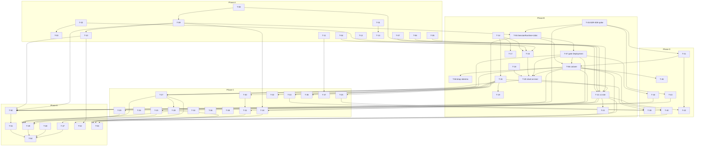

# gonk: delivery plan to the original stated goals

- **Date:** 2026-09-08 (rev 2, after joint review of T-08 and T-45)
- **Input:** `docs/reviews/2026-09-08-independent-code-review.md` (finding IDs
  `R-nn`) and the master spec
  `docs/superpowers/specs/2026-07-12-gonk-stack-design.md` (§2 goals G1–G8,
  §11 milestones M1–M6).
- **Audience:** an orchestrating session that dispatches each task to a
  subagent (Opus or Sonnet class) in its own git worktree, then verifies with
  a fresh agent. Every task block below is written to be pasted, verbatim, as
  that subagent's entire brief together with §2.3. Nothing in a task assumes
  the subagent has read this conversation.
- **Decisions already made (do not reopen in a task):**
  - **T-08:** Navigator stays. The `.agent/` gate on triage goes; the onboarding
    MR carries a deterministic `.agent/` seed; the metered scaffold session is
    opt-in v1.5.
  - **T-45:** Kubernetes Jobs replace Gas City as the session runtime (option
    B) unless the T-45 spike overturns it on evidence. Downstream tasks are
    written for B. No workflow engine is adopted; multi-step work, if it ever
    arrives, is gonk-gate chaining Jobs. Gas City convoys are a v3 hypothesis
    to be re-evaluated then, behind a `SessionRuntime` interface.
- **Status:** ready to file in `bd`. Task IDs are stable; new tasks from the
  T-45 decision are T-55..T-58.

---

## 0. What "done" means

The target is the master spec's v1, unchanged in substance: a Helm chart plus
two services that let a bot user triage issues on a self-hosted GitLab with
attributed, hard-budgeted, local-first inference, provably, from one chart.
Everything in the later specs (source beads, verified change pipeline,
trajectory enforcement, buildkit, Warp parity phases 1–6) is **out of scope**
and stays parked until §1 is green.

Non-goals stay non-goals: no pipeline fixing, no auto-merge, no cluster-event
ingestion, no multi-harness rungs, no fairness scheduling.

### 0.1 Phases

1. **A — Stop the bleeding, delete the dead model.** Small, mechanical.
2. **B — Decide the runtime, then make the evidence machine run.** T-45 first,
   then the B-branch tasks, then every existing suite runs somewhere, then the
   one e2e scenario that defines v1.
3. **C — Trust boundary and budget truth**, each fix proven by the harness.
4. **D — Consolidate.** Merge duplicates, shrink gates.
5. **E — Publish.** Docs match code, deployment material out, repo public.

Sizes: **S** ≤ half a day, **M** ≤ 2 days, **L** ≤ a week, **XL** produce a
plan file first, then stop for review. Sizes assume an agent session.

---

## 1. Exit criteria for v1

| # | Criterion | Spec | Closed by |
|---|---|---|---|
| E1 | `helm install chart/gonk -f chart/values-e2e.yaml` on kind in CI succeeds; after settle, zero agent Jobs and zero agent pods | M1, G1 | T-20 |
| E2 | In CI, inviting the bot to a fresh gitlab-ce project yields the onboarding MR carrying `.gonk.yml` and the `.agent/` seed; merging it makes the project dispatchable with no further MR | M2, G2 | T-21, T-08 |
| E3 | In CI, opening an issue yields exactly one bot comment carrying the bead marker plus `gonk::` labels, produced by the stub model through LiteLLM, with no PAT in the agent pod | M3, G3 | T-21 |
| E4 | In CI, `/cost/bead/{anchor}` and `/cost/project/{id}` report the stub's token totals, and LiteLLM's key has `max_budget` equal to the project ceiling; setting the ceiling below the reservation yields `defer` and no Job | M5, G4 | T-21, T-30, T-31 |
| E5 | In CI, an `@gonk` mention on the triaged issue yields exactly one follow-up comment in that thread | G3 | T-24 |
| E6 | Every `//go:build` tag in the repo appears in a `go test -tags` line of at least one CI job that runs on every push; `t.Skip` on missing infrastructure fails when `CI=true` | G7, §10 | T-14, T-15 |
| E7 | Kill tests in CI: SIGKILL meter, restart LiteLLM, restart gitlab-ce, restart gonk-gate mid-flow → no lost work item, no duplicate comment, no rung escalation | M6 | T-42 |
| E8 | The NetworkPolicy probe reports ENFORCED in the CI cluster; an agent pod cannot reach Postgres, meter, intake or the API server; gonk-gate can reach meter, GitLab and the API server | G5, §9 | T-27, T-28 |
| E9 | Spec, `PLAN.md`, `README.md`, `HANDOFF` describe the shipped architecture, test tiers and security posture; `grep -r 'orac.local'` outside `docs/environment.md` is empty; the repo is public | G8 | T-50..T-54 |
| E10 | Session resume is formally dropped from v1 with `continuity` removed from the schema (Jobs are single-run) | M4 | T-43 |

---

## 2. Dispatch protocol (for the orchestrating session)

### 2.1 Filing

1. Create one bead per task with `bd create`, title = the task's title, body =
   the task block verbatim. Add `bd dep` edges from §4. Close or re-parent the
   subsumed beads listed in §6.
2. Record the wave number as a label so `bd ready` returns the current wave.

### 2.2 Per-task dispatch

For each task in the current wave, in parallel:

1. `git worktree add ../gonk-T-nn -b task/T-nn-<slug> main`.
2. Spawn a subagent of the class the task's **Model** field names. Its prompt
   is: §2.3 (the common rules) + the task block. Nothing else.
3. The subagent commits on its branch, runs `make gate`, pushes, and reports
   using the **Report** section of its task.
4. Do **not** merge on the subagent's report.

### 2.3 Common rules for every task subagent (paste with each task)

```
You are implementing one task from docs/reviews/2026-09-08-delivery-plan.md
in the gonk repository, in your own git worktree and branch. Rules:

1. Read only what the task's "Read first" section names, plus files you must
   edit. Do not read the whole review or plan.
2. Touch only files the task's "Change" section names or clearly implies.
   "Do not" lists are hard limits. If the task cannot be completed without
   going outside its scope, STOP, write what you found and why, and report;
   do not widen the task. The same applies when the task is WRONG as written:
   if it names a function, file, route, test or command that does not exist,
   STOP and report the phantom. Do NOT silently substitute the nearest real
   thing. (Four phantoms have already shipped this way: T-06's
   CreateDiscussionNote, T-07's L1 transcript route, T-13's Verify regex
   matching no test, T-14's -run exclusion that cannot express exclusion.)
3. Exit criteria are the contract. Each one must be backed by evidence you
   can point at: a test name that fails before and passes after, a command
   output, a file diff. "It should work" is not evidence.
4. Tests assert an expected VALUE, never that a response merely parsed or a
   file merely exists. If you write a check, first make it fail on purpose.
4b. A RED GATE IS NEVER ACCEPTABLE -- not once, not temporarily, not "known".
   Do not tune a threshold until it passes, do not skip the test, and do not
   move it to another job where it can be red more quietly. Fix the cause, or
   fix the assertion and say why. Those are the only two outcomes. A gate that
   is allowed to stay red stops meaning anything, which is exactly how
   test/component and test/images stayed broken for weeks unnoticed.
5. Before pushing run `make gate` (fmt, vet, test, lint). If `make lint`
   fails because the host golangci-lint version mismatches, run
   `go vet ./... && go test ./... -count=1` and say so in the report.
   Never skip, disable or quarantine a test to get green.
6. If you touch anything under chart/, bump chart/gonk/Chart.yaml version
   and run `make chart-seal` and `make chart-goldens`, or the build gate
   fails (gonk-sjb).
7. Vendored modules: after any `go get`, run `go mod vendor` and commit
   vendor/. CI has no module proxy.
8. Commit messages: `<type>(<scope>): <summary>` then a body explaining
   why. No model identifiers anywhere in commits, code or docs.
9. A criterion phrased "CI run shows ..." is satisfied ONLY by a run URL in
   the report. You cannot observe CI from a worktree; mark it BLOCKED-ON-CI
   and say what must happen to close it. Never grade it PASS from a local run.
10. A task that adds a required Secret, changes a chart default, or changes
   anything Flux applies MUST state the gitops-side prerequisite in its
   report and in the chart README. The orchestrator checks the gitops repo
   before merging. (T-26 added a fail-closed guard whose default named a
   Secret the cluster did not have; the chart would have rendered, the
   StatefulSet would have rolled, and the new pod would have hung on
   FailedMount with the beads store down. No test in this repo could see it.)
11. Report format (paste at the end of your final message):
   TASK: T-nn
   STATUS: done | partial | blocked
   EXIT CRITERIA: one line per criterion: PASS/FAIL + evidence location
   TESTS ADDED: names
   FILES CHANGED: list
   OUT OF SCOPE FOUND: anything you noticed and did not fix
   BRANCH: name, pushed: yes/no
```

### 2.4 Verification (fresh agent, per wave)

After a wave's subagents report, spawn a **new** agent (Opus class) with the
task blocks of that wave and this instruction:

```
For each task, check out its branch and, for EACH exit criterion, find the
evidence in the diff or by running the named command. Grade PASS, PARTIAL or
FAIL per criterion with the location of the evidence. Do not trust the
subagent's report; re-run tests. Report per task, per criterion. A task with
any FAIL or PARTIAL criterion is not done.
```

Merge only tasks graded all-PASS. Return PARTIAL/FAIL tasks to a subagent
with the verifier's findings appended to the brief.

**The orchestrator pastes the verifier's per-criterion grades into the bead's
close note.** A bare `Closed` is not a record: it cannot be distinguished
later from "asserted". Every task closed in waves 1-3 has `close_reason:
Closed`, which is why a reviewer could not tell that T-15 was closed while the
CI job it added had never once been green.

### 2.5 Model hints

- **sonnet:** mechanical, fully specified, single-package changes.
- **opus:** cross-package, design judgement inside a fixed envelope, or
  anything touching money, credentials or the runtime.
- **opus, plan first:** XL. The subagent writes `docs/plans/<date>-T-nn.md`
  with sub-tasks and exit criteria, pushes, and STOPS for review.

---

## 3. Tasks

Task block format:

- **Phase · Size · Model.** _Closes:_ findings / beads. _Depends on:_ tasks.
- **Goal.** One or two sentences.
- **Read first.** Bounded list.
- **Change.** What to do, by file.
- **Do not.** Scope fence.
- **Exit criteria.** Numbered, each checkable.
- **Verify.** Commands.
- **Traps.** Known pitfalls from the review.

### Phase A — stop the bleeding, delete the dead model

---

#### T-01 · Reaper matches broker aliases

**A · S · sonnet.** _Closes:_ R-01. _Depends on:_ none. _Interim:_ deleted at
T-56 cutover; fix it anyway, it is deployed today.

**Goal.** The orphan-session reaper's regex predates the nonce suffix that
every broker session alias now carries, so it matches nothing gonk creates.

**Read first.** `cmd/gonk-gate/reap.go` (the `gonkSessionAlias` regex and
`runReap`), `cmd/gonk-gate/broker_inject.go` lines 80–96
(`brokerSessionAlias`), `cmd/gonk-gate/reap_test.go`.

**Change.** Extend the regex to require the base32 nonce segment
(`[A-Z2-7]{26}`) after the attempt segment, keeping every existing shape
rule. Add tests that build aliases with `brokerSessionAlias` for triage and
scaffold shapes.

**Do not.** Do not widen to `^gonk\.`. Do not change `brokerSessionAlias`.

**Exit criteria.**
1. A test constructs an alias via `brokerSessionAlias("triage", 75, 35, 1)`
   and asserts `gonkSessionAlias.MatchString` is true; same for the scaffold
   shape (issue 0).
2. A test asserts an old-style alias without nonce and `gonkish.triage.p1.a1`
   both do NOT match.
3. A reaper test feeds a nonce-suffixed alias with no claiming bead and
   asserts `CloseSession` is called; a claimed one is not closed.
4. All existing reaper tests updated to nonce-suffixed aliases and passing.

**Verify.** `go test ./cmd/gonk-gate/ -run 'Reap|Alias' -count=1 -v`

**Traps.** The regex comment explains why the leading `^gonk\.` and strict
segments exist; keep that property.

---

#### T-02 · Entrypoint survives unset `GC_ALIAS` and logs before anything can fail

**A · S · sonnet.** _Closes:_ R-06, R-37. _Depends on:_ none.

**Goal.** Under `set -eu`, line 68 of the entrypoint expands `GC_ALIAS`
unguarded; an unset alias aborts before the first log line, into a detached
tmux pane, so the pod shows nothing.

**Read first.** `images/agent/entrypoint.sh` lines 30–75 and 250–270,
`test/entrypoint/lifecycle_log_test.go`, spec §8.1 (the lifecycle-log
guarantee).

**Change.**
1. Compute the alias prefix with `${GC_ALIAS:-}` semantics; emit
   `session start:` first; then, if the alias is empty, log a refusal reason
   and exit with a distinct code.
2. Add `_clean` to the redaction test's forbidden list; `unset _pkey` after
   its last use.
3. Add a test in `test/entrypoint/` that runs `entrypoint.sh` under
   `sh -eu` with an empty environment plus a fake `opencode` and fake `curl`
   on `PATH` (shell scripts in `testdata/`), captures stdout, and asserts
   both a `session start:` line and a `session end:` line appear.

**Do not.** Do not restructure the entrypoint; do not touch the provider
check or the prompt fetch loop (T-03 owns that).

**Exit criteria.**
1. Running the script with `GC_ALIAS` unset prints `session start:` then a
   `session end:` line naming the missing alias, and exits non-zero.
2. `TestEveryExitPathLogsATerminalLine` still passes.
3. The new fake-PATH test exists and passes; the redaction test lists
   `_clean`.
4. `grep -n '_pkey' entrypoint.sh` shows an `unset _pkey`.

**Verify.** `go test ./test/entrypoint/ -count=1 -v`

**Traps.** The tee to `/proc/1/fd/1` is what makes logs visible; keep it
first. `set -u` also bites `${GC_WEBHOOK_ARG_ATTEMPT:-?}`-style expansions
elsewhere; do not "fix" those, they are already guarded.

---

#### T-03 · Prompt fetch retries transport failures for the whole window

**A · S · sonnet.** _Closes:_ R-07. _Depends on:_ T-02 (fake-PATH harness).
_Interim:_ the fetch loop is deleted at T-56; fix it anyway.

**Goal.** `curl … -w '%{http_code}' || echo 000` yields `000000` on transport
failure; the `*)` arm breaks the loop, so one refused connection exits 4
after zero retries despite a 120-second window.

**Read first.** `images/agent/entrypoint.sh` lines 215–262; the T-02 test
harness.

**Change.** Treat any non-3-digit or `000` code like `404` (keep waiting).
Fake-curl tests: (a) first call refuses, second returns 200 → run starts;
(b) all calls refuse → exit 4 after the deadline with a logged reason.

**Do not.** Do not change the deadline default or the 410 handling.

**Exit criteria.**
1. Test (a) passes: one failure then success starts the run.
2. Test (b) passes: exhaustion exits 4 with a `session end:` reason.
3. A 410 still exits 3 immediately (existing behaviour, add an assertion).

**Verify.** `go test ./test/entrypoint/ -count=1 -v`

---

#### T-04 · `make no-latest` fails on grep error; one no-latest gate

**A · S · sonnet.** _Closes:_ R-38, R-39. _Depends on:_ none.

**Goal.** The Makefile target turns a grep *error* into a pass, and the Go
test with real coverage is behind a build tag that never runs and is red.

**Read first.** `Makefile` lines 139–185 (`no-latest`, `BANNED_TAG`),
`test/images/nolatest_test.go`, `internal/buildgate/` (for where an
untagged repo-shape test belongs).

**Change.**
1. Makefile: capture grep's exit code; `0` → fail (found), `1` → pass,
   `≥2` → fail with grep's stderr shown.
2. Move `TestNothingSaysLatest` and `TestBaseImagesArePinnedByDigest` out
   of the `images` tag into `internal/buildgate/` so they run in the default
   gate; fix the false positives: exclude `crd-schemas`, skip lines
   containing `{{`, do not scan `.go` files or `test/harness/`.
3. Delete the old copies under `test/images/`.

**Do not.** Do not touch other `test/images` tests.

**Exit criteria.**
1. A planted `FROM debian:latest` line in a Dockerfile fails both
   `make no-latest` and `go test ./internal/buildgate/`; reverted after.
2. `make no-latest` with a deliberately bad grep flag exits non-zero.
3. `go test ./internal/buildgate/ -count=1` passes on a clean tree.

**Verify.** `make no-latest; go test ./internal/buildgate/ -count=1 -v`

**Traps.** The banned token must never appear contiguously in Makefile
comments (see the `$(empty)` trick).

---

#### T-05 · Label effects cannot escape `gonk::` or mint audit labels

**A · S · sonnet.** _Closes:_ R-02. _Depends on:_ none.

**Goal.** `AddIssueLabel` sends `add_labels=<value>`, which GitLab splits on
commas, and `normaliseLabel` passes through any label already prefixed
`gonk::`, so an agent can apply `security::critical` or mint
`gonk::fix-queued`.

**Read first.** `cmd/gonk-gate/broker_label.go`, `broker_verdict.go` lines
1–20 (the reserved labels), `pkg/glab/write.go` lines 90–105,
`cmd/gonk-gate/broker_label_test.go`.

**Change.**
1. `normaliseLabel` returns an error (batch refused, not sanitised) for: a
   comma anywhere, whitespace-only, length > 255 bytes, or a post-prefix
   value in the reserved set (`fix-queued`, `needs-maintainer`, `denied`,
   and the `gonk::` state labels). Export the reserved set from one place.
2. `AddIssueLabel` sends a JSON body `{"add_labels": [...]}` (GitLab accepts
   an array) instead of a query string.
3. Tests for each rejection and the happy path; a `glabtest` assertion that
   the request body is JSON.

**Do not.** Do not change the label prefix semantics or the `Gonk/bug`
case-fold rule.

**Exit criteria.**
1. `normaliseLabel("bug,security::critical","gonk::")` returns an error.
2. `normaliseLabel("gonk::fix-queued","gonk::")` returns an error.
3. The broker apply path refuses the whole batch when any label errors
   (test asserts zero GitLab writes).
4. `AddIssueLabel` sends a JSON body (test on `glabtest` request capture).

**Verify.** `go test ./cmd/gonk-gate/ ./pkg/glab/... -count=1`

---

#### T-06 · Comment effects cannot execute quick actions; bodies are bounded

**A · S · sonnet.** _Closes:_ R-03, R-16. _Depends on:_ none.

**Goal.** Comment bodies are posted verbatim under the bot PAT and GitLab
executes quick actions (`/close`, `/label`, `/assign`, `/confidential`,
`/due`, …) in Notes-API notes. Bodies also travel as URL query parameters.

**Read first.** `pkg/effects/effects.go` (the `comment` kind and `file` cap),
`cmd/gonk-gate/broker_apply.go` lines 280–305, `pkg/glab/write.go`
`CreateIssueNote` / `CreateDiscussionNote`.

**Change.**
1. `pkg/effects` validation rejects a comment whose any line, after trimming,
   starts with `/` followed by a letter. Reject, do not strip.
2. Cap comment bodies at 64 KiB in the same validator.
3. `CreateIssueNote` / `CreateDiscussionNote` send `{"body": ...}` as JSON.
4. Tests: a batch with `/close` on its own line is refused and `glabtest`
   records zero note creations; a 65 KiB body is refused; a legitimate body
   containing `path/to/file` mid-line passes.

**Do not.** Do not attempt a quick-action allow-list.

**Exit criteria.**
1. Refusal test for `/close` passes with zero GitLab writes.
2. Size cap test passes.
3. JSON body test passes.
4. Existing broker round-trip test still passes.

**Verify.** `go test ./pkg/effects/ ./cmd/gonk-gate/ ./pkg/glab/... -count=1`

---

#### T-07 · Transcript reads scale to real sessions

**A · S · sonnet.** _Closes:_ R-10. _Depends on:_ none. _Interim:_ under
Jobs (T-55) the transcript source becomes pod logs; keep the parser and cap
logic, they carry over.

**Goal.** `GetSessionTranscript` errors above 64 KiB; the triage prompt now
tells the model to list directories and read code, so real transcripts
exceed that and the sweep loops `infra-failed` with a valid batch unread.

**Read first.** `pkg/gcapi/transcript.go`, `pkg/gcapi/client.go` lines
180–320 (`readCapped`, `maxResponseBytes`), `cmd/gonk-gate/sweep.go` where
the transcript is consumed, `pkg/effects` `ParseBatch`.

**Change.** Raise the transcript-read cap to 4 MiB via a dedicated limit
(not the generic 64 KiB API cap) and extract the batch from the tail. Add a
test with a 300 KiB transcript whose batch is at the end and assert
classification `complete`. Make the L1 synthetic session use a transcript
above 64 KiB.

**Do not.** Do not raise the generic API response cap.

**Exit criteria.**
1. 300 KiB transcript test classifies `complete`.
2. The sweep classifies a transcript above the cap as a TERMINAL
   `infra-failed`, not a retry loop (test). AMENDED 2026-09-10: the original
   criterion asked for the L1 synthetic session to carry a >64 KiB
   transcript, but `test/integration` has no session or transcript route at
   all -- it drives intake and the meter only. The criterion named a path
   that does not exist.
3. A transcript above 4 MiB still errors with a named error.

**Verify.** `go test ./pkg/gcapi/... ./cmd/gonk-gate/ ./test/integration/ -count=1`

---

#### T-08 · Onboarding ends with a triageable project and a `.agent/` seed

**A · M · opus.** _Closes:_ `gonk-bgx`, `gonk-msz`. _Depends on:_ none.

**Goal.** Navigator is **not** removed. ADR-007 §5 keeps its
conventions-plus-lint half as the orientation tier and `.agent/` stays its
project-side home. What changes: `.agent/` becomes optional context for
triage instead of a precondition, and the seed arrives with the onboarding
MR (deterministic, zero tokens) instead of from a metered session.

**Read first.** `pkg/intake/state.go` (the `pending` state and `MayScaffold`),
`pkg/intake/dispatch.go` lines 170–190, `pkg/intake/onboard.go` (the MR
render), `pkg/gonkcfg` schema for `actions`, `cmd/gonk-gate/broker_inject.go`
`renderTriagePrompt`, spec §5.3, ADR-007 §5.

**Change.**
1. **Remove the gate, keep the state.** `Decide` no longer returns
   `state_pending`; `pending` remains a classified, metric-visible state
   meaning "no `.agent/` yet". The broker triage prompt includes `.agent/`
   contents first when the directory exists (this is the v1 thin loader).
2. **The onboarding MR carries a `.agent/` seed.** Rendered from real config
   values with the same discipline as the `.gonk.yml` explanation: a
   `.agent/README.md` stating what `.agent/` is for and the two ways to fill
   it in (run Navigator locally; ask gonk to draft it once part 3 ships),
   plus skeleton files with the expected headings.
3. **The metered scaffold becomes opt-in and leaves v1.** `MayScaffold` and
   the project-scoped trigger stay, gated on `actions.scaffold: true`
   (default false; additive schema change). Until the `file` effect kind and
   `gonk-066` exist, the trigger is dormant, not broken.
4. Amend spec §5.3 accordingly.

_Optional part 5 (S; may be split out):_ a schema check on `.agent/` at
reconcile time, like `.gonk.yml`, so an invalid `.agent/` is a distinct
visible state and the prompt skips it.

**Do not.** Do not implement the `file` effect kind. Do not touch the
formula-path scaffold (T-09 deletes it).

**Exit criteria.**
1. A project with merged `.gonk.yml` and no `.agent/` dispatches triage
   (test in `pkg/intake`, asserts a `run` decision).
2. The onboarding MR in `glabtest` contains `.gonk.yml`, `.agent/README.md`
   and the skeleton files; a test asserts a rendered *value* from config
   (e.g. the label prefix) appears in the README.
3. `actions.scaffold` defaults false; `MayScaffold` is false when unset;
   schema drift pin updated as an additive change.
4. Broker prompt test shows `.agent/` content precedes the issue body when
   present, and the prompt is unchanged when absent.
5. Spec §5.3 amended; `gonk-bgx` and `gonk-msz` closed with a pointer.

**Verify.** `go test ./pkg/intake/... ./pkg/gonkcfg/... ./cmd/gonk-gate/ -count=1`

**Traps.** The published schema copy and its sha256 pin must be updated
together (`pkg/gonkcfg/drift_test.go`). The `pending` state is a metric
label; do not rename it.

---

#### T-09 · Delete the formula layer (ADR-007 §3)

**A · M · sonnet.** _Closes:_ `gonk-p2e`, half of `gonk-ecn`, R-08.
_Depends on:_ T-08.

**Goal.** Formulas, `[steps.check]`, the `check` subcommand, the
control-dispatcher agent and the prompt templates are dead by ADR-007 and
still shipped; their stale beads generate permanent pool demand.

**Read first.** ADR-007 §3, `pack/` (whole tree, it is small),
`cmd/gonk-gate/dispatch.go` lines 15–60 and 300–330, `cmd/gonk-gate/check.go`,
`internal/packtest/pack_test.go`, `test/images/packvalidate_test.go`.

**Change.**
1. Delete `pack/formulas/`, `pack/orders/gonk-{triage,scaffold,mention}.toml`,
   `pack/scripts/gonk-check.sh`, `pack/agents/*/prompt.template.md`,
   `pack/agents/control-dispatcher/`, `cmd/gonk-gate/check.go` and its test.
2. Remove the formula-pour branch from `dispatch.go`; remove `litellm_key`
   and `bot_token` from order vars.
3. Update `internal/packtest` and `test/images/packvalidate_test.go` to the
   reduced pack (orders: `gonk-dispatch`, `gonk-sweep` only).
4. Write `hack/close_formula_beads.sh` that lists and closes beads whose
   `gc.routed_to` names a deleted formula; document the count in the commit.

**Do not.** Do not implement mention on the broker path (T-24). Do not touch
the controller image beyond what the pack deletion requires.

**Exit criteria.**
1. `grep -rn 'formula' cmd/ pkg/ pack/ --include=*.go --include=*.toml`
   returns only historical comments or nothing.
2. `go build ./... && go vet ./...` clean; `internal/packtest` passes.
3. `dispatch.go` has no code path that sends `litellm_key` or `bot_token`
   (test asserts the vars map keys).
4. The bead-closing script exists and is documented in the commit body.

**Verify.** `go test ./internal/packtest/ ./cmd/gonk-gate/ -count=1`

**Traps.** `TestEveryTriggerOrderExists` currently pins `mention-reply →
gonk-mention`; change it to expect the mention trigger to be routed to the
broker (T-24 will make it real) or skip mention with a named reason.

---

#### T-10 · Delete dead Go: `trailers`, `pkg/verify`, `SubmitSession`, entrypoint fallbacks

**A · M · sonnet.** _Closes:_ review §5 delete rows 3–6, R-35.
_Depends on:_ T-09.

**Goal.** Four pieces have no live caller: the commit-trailer hook (never
installs in a pod), `pkg/verify` (zero importers), `gcapi.SubmitSession`
(superseded by prompt-by-reference), and the entrypoint's HTML-marker and
static-key fallback branches.

**Read first.** `cmd/gonk-gate/trailers.go`, `images/agent/prepare-commit-msg`,
`pkg/verify/`, `pkg/gcapi/submit.go`, `images/agent/entrypoint.sh` lines
265–330 and 335–360.

**Change.** Delete them and their tests. Strike PLAN.md's Task 8 contract
entry with a pointer to this commit. Mark spec §6.1's trailer paragraph
"not in v1".

**Do not.** Do not delete `pkg/trace` (observe-only but wired).

**Exit criteria.**
1. `go build ./... && go vet ./... && golangci-lint run ./...` clean.
2. `grep -rn 'gonk:model:\|GONK_LITELLM_KEY\b' images/` returns nothing.
3. PLAN.md and spec edits present.

**Verify.** `make gate` (or vet+test if lint is version-blocked).

---

#### T-11 · Operator config cannot brick every project

**A · S · sonnet.** _Closes:_ R-20, R-22, R-24. _Depends on:_ none.

**Goal.** An operator `schedule.quiet_hours` without `timezone` passes
validation, then every project's registration fails and its key is deleted
on the next hot reload. Group keys with a trailing `/` never match.

**Read first.** `pkg/opercfg/opercfg.go` lines 370–400 (`checkPolicy`) and
380–395 (`GroupFor`), `docs/schemas/gonk-operator.v1.schema.json`,
`pkg/gonkcfg/resolve.go` lines 95–105, `internal/meter/service/service.go`
lines 376–395, ADR-002.

**Change.**
1. `opercfg.Load` rejects `quiet_hours` without `timezone` at any layer, and
   group keys ending in `/`.
2. `.gonk.yml` schema requires `timezone` alongside `quiet_hours` (additive:
   tighten the schema, bump the sha256 pin, document in ADR-002).
3. Corpus entries for each rejection.
4. A test that hot-reload keeps the previous config on rejection.

**Do not.** Do not change `Resolve`'s schedule merge semantics (record the
representational limit in ADR-002 instead).

**Exit criteria.**
1. `opercfg.Load` on `{instance:{ladder:[a],schedule:{quiet_hours:"22:00-07:00"}}}`
   returns an error naming `timezone`.
2. `groups: {'g/': …}` is rejected.
3. Corpus and hot-reload tests pass.

**Verify.** `go test ./pkg/opercfg/... ./pkg/gonkcfg/... ./test/corpus/ ./cmd/gonk-meter/... -count=1`

---

#### T-12 · Archived and removed projects lose their key

**A · S · sonnet.** _Closes:_ R-15. _Depends on:_ none.

**Goal.** `seen[p.ID]` is set before `reconcileProject` returns early on an
archived project, so the vanished-membership sweep skips it and the LiteLLM
key stays live.

**Read first.** `pkg/intake/reconcile.go` lines 495–545 and 675–690,
`pkg/glab/glabtest/server.go` (project listing).

**Change.** Deregister from meter on the pass that observes `Archived`;
`glabtest` gains an archived project; test asserts `Meter.Deregister` was
called once and the cache entry removed.

**Exit criteria.**
1. New test passes; existing reconcile tests pass.
2. ADDED 2026-09-10: a second reconcile pass after a successful
   deregistration issues NO meter call (test). As merged, every archived
   project is deregistered on EVERY pass forever -- a meter DELETE, a Secret
   delete, a DB delete and a `MeterPush("ok")` each time, and `Errors++` per
   project per pass whenever the meter is down. Tombstone in the cache after
   a successful deregister, or GET the registration first and skip when
   absent.

**Verify.** `go test ./pkg/intake/... -count=1`

---

#### T-13 · Session dedupe holds across the delivery window

**A · S · sonnet.** _Closes:_ R-11, part of `gonk-6n8`. _Depends on:_ T-01.
_Interim:_ under Jobs (T-55) a deterministic Job name makes duplicates a 409
at the API server; this task is the stop-gap for the deployed shape.

**Goal.** The bead record is written only after the prompt fetch, so a
re-dispatch inside the ≤240 s window mints a second session and the second
write overwrites `SessionID`, orphaning the first.

**Read first.** `cmd/gonk-gate/broker_inject.go` lines 560–600 and 730–760,
`cmd/gonk-gate/dispatch_idempotency_test.go`.

**Change.** Write the record with a `pending-prompt` state before storing the
prompt; a second dispatch for the same attempt inside the window returns the
existing session. Test: two dispatches 1 s apart against `gcapitest` → one
`sessions` POST.

**Exit criteria.**
1. The two-dispatch test asserts exactly one session create.
2. Existing idempotency tests pass.
3. ADDED 2026-09-10: a failed re-dispatch of a parked or running bead leaves
   the record in its PRIOR state (test), and `runSweep` reclaims
   `pending-prompt` records older than the delivery window (test, both
   directions). As first merged the deferred release re-wrote the record as
   `pending-prompt` with only `SessionID` cleared, so any failed dispatch --
   not merely a hard crash -- stranded it in a state neither sweep pass
   lists, and a failed re-dispatch DOWNGRADED a reclaimable `StateParked`
   bead into an unreclaimable one.

**Verify.** `go test ./cmd/gonk-gate/ -run 'Idempot|Dedupe' -count=1 -v`

---

### Phase B — decide the runtime, then make the evidence machine run

---

#### T-45 · Session runtime decision (ADR-008): Kubernetes Jobs by default

**B · M spike · opus.** _Closes:_ review §5 last row, §6.3; the
upstream-blocked class `gonk-alw`, `gonk-p2e`, `gonk-6gs`, `gonk-njz`,
`gonk-cw3`. _Depends on:_ none (can run alongside T-09). _Blocks:_ T-55,
T-56, T-57, T-58, T-20, T-21, T-41, T-42.

**Goal.** Record, on evidence, the decision to replace Gas City with
Kubernetes Jobs as the session runtime, and state what would reverse it.
The default is Jobs; Gas City must make its case.

**Premise to confirm, not assume.** Gas City's model is refinery workers
converging on beads with `[steps.check]` as the judgment, so acceptance is
model-mediated. gonk's invariant is deterministic judgment before dispatch
(Gate 1, Gate 2) and after (classifier, broker), no LLM judges. gonk today
uses Gas City as an externally driven pod launcher: seven client methods,
four of which are start/read/stop.

**Read first.** `pkg/gcapi/client.go` exported methods and their non-test
callers (`grep -rn '\.CreateSession(\|\.CloseSession(\|\.RunOrder(\|\.GetSessionOutput(\|\.GetSessionTranscript(\|\.ListSessions(\|\.AwaitRequestOutcome(' cmd pkg internal --include=*.go | grep -v _test`),
`cmd/gonk-gate/broker_inject.go`, `cmd/gonk-gate/sweep.go`, ADR-007 §3,
`docs/upstream/CONTRIBUTIONS.md`, the pinned Gas City source at
`images/versions.env` `GASCITY_REF` (clone it read-only into the scratch
directory: `internal/convergence/`, `internal/orders/`, `internal/runtime/k8s/`,
and whatever implements convoys).

**Change (spike, no production code).**
1. Prototype option B on a kind cluster: gonk-gate creates one Job per
   session with the existing agent image; prompt, checkout tarball and
   virtual key mounted as Secret volumes; `activeDeadlineSeconds` =
   reservation TTL; `backoffLimit: 0`; `ttlSecondsAfterFinished` set;
   completion from Job status; batch from pod logs. It must run the existing
   L1 synthetic scenario end to end.
2. Read the Gas City source and answer, with file citations: (a) can its
   acceptance path host a non-model pre-dispatch gate and a non-model
   post-dispatch, pre-merge gate without bypassing its own convergence?
   (b) do convoys coordinate items in a way that could carry deterministic
   gates between grouped items, or do they presuppose model judgment of the
   group?
3. Write `docs/adr/ADR-008-session-runtime.md`: decision (Jobs), the
   premise findings (a) and (b) with citations, the LOC added/deleted ledger
   (measured from the prototype and `wc -l` of the deletion list), the
   upstream bugs that disappear, the capabilities lost (resume, pool
   scaling, pack composition, convoys), the `SessionRuntime` interface as
   the re-adoption seam for convoys in v3, and one paragraph on why no
   workflow engine is adopted (Flux-deployed cluster; multi-step is
   gonk-gate chaining Jobs if ever needed).
4. State the reversal condition explicitly: "if (a) is yes AND the
   prototype needs more than N workarounds, reopen."

**Do not.** Do not delete anything. Do not modify the chart. Do not
evaluate other frameworks.

**Exit criteria.**
1. Prototype branch exists and a recorded run shows a Job completing the L1
   scenario with the batch read from logs (paste the run log location).
2. ADR-008 answers (a) and (b) with source citations.
3. ADR-008 contains the deletion list, the measured LOC ledger, and the
   reversal condition.
4. The orchestrator confirms the decision; if reversed, T-55..T-58 are
   replaced by their Gas City-shaped equivalents recorded in the git history
   of this file (rev 1).

**Verify.** Prototype run log; ADR review.

**Traps.** Gas City's k8s provider labels pods `app: gc-agent`; the chart's
NetworkPolicy selector depends on it. Note in the ADR which labels the Job
pods will carry so T-27 can follow.

---

#### T-55 · `SessionRuntime` interface with a Jobs implementation

**B · L · opus.** _Closes:_ R-04, R-06 (root cause), R-07 (root cause),
R-13, R-34, `gonk-alw`, `gonk-njz`, `gonk-cw3`. _Depends on:_ T-45, T-09.

**Goal.** Replace the seven Gas City calls with a narrow Go interface and a
Kubernetes Jobs implementation. Prompt, checkout and key are delivered as
volumes at creation, so prompt-by-reference, the rig grant and the meter
prompt routes are no longer needed.

**Read first.** ADR-008; `cmd/gonk-gate/broker_inject.go`,
`cmd/gonk-gate/sweep.go`, `cmd/gonk-gate/keyread.go`, `pkg/rig/`,
`internal/meter/service/http.go` prompt routes, `images/agent/entrypoint.sh`.

**Change.**
1. `pkg/runtime/` defines `SessionRuntime` with `Create(spec) (id, error)`,
   `Status(id)`, `Output(id)` (logs), `Close(id)`, `List()`. Spec carries
   image, env, the prompt, the checkout tarball, the LiteLLM key, deadline.
2. `pkg/runtime/jobs/` implements it with client-go: one Job per session,
   deterministic name `gonk-<agent>-p<id>-i<iid>-a<n>` (duplicate create →
   AlreadyExists → return existing), Secret per Job for prompt+key,
   ConfigMap or Secret for the tarball, `activeDeadlineSeconds`,
   `backoffLimit: 0`, `ttlSecondsAfterFinished`, owner references so
   Secrets are garbage-collected with the Job, labels `app: gonk-agent`,
   `gonk/session: <name>`.
3. `pkg/runtime/fake/` in-memory implementation for unit tests.
4. gonk-gate dispatch and sweep use the interface; the checkout is fetched
   by gonk-gate (it already holds the PAT) and passed in the spec.
5. Entrypoint: read prompt, key and tarball from mounted paths; delete the
   fetch loop; keep provider check, lifecycle log, redaction.
6. `test/integration` runs against `fake`; an envtest or kind-based test
   under `-tags component` runs against the real Jobs implementation.

**Do not.** Do not delete `pkg/gcapi` yet (T-56). Do not change the meter
`/decide` contract.

**Exit criteria.**
1. `pkg/runtime` interface + `jobs` + `fake` exist with tests; `jobs` has a
   duplicate-create test asserting the existing Job is returned.
2. `cmd/gonk-gate` has no import of `pkg/gcapi` on the dispatch or sweep
   path (grep proof).
3. Entrypoint reads from mounted paths; `test/entrypoint` fake-PATH test
   updated; no `curl` invocation remains for prompt or key.
4. L1 integration passes on `fake`; the component test creates a real Job on
   kind and reads a batch from its logs.
5. A Job that exceeds `activeDeadlineSeconds` is observed as failed and the
   sweep classifies it `infra-failed` (test).

**Verify.** `go test ./pkg/runtime/... ./cmd/gonk-gate/ ./test/integration/ -count=1`; `go test -tags component ./pkg/runtime/jobs/ -count=1` on kind.

**Traps.** Secret size limit is 1 MiB; a checkout tarball above that needs
an emptyDir init container that fetches from intake with a per-Job token, or
a size cap with a clear refusal. Decide in-task and record in ADR-008.

---

#### T-56 · Cutover: delete the Gas City surface

**B · L · opus.** _Closes:_ R-01 (root), R-05, R-11 (root), R-46, R-47,
R-48, R-49, R-52, `gonk-p2e`, `gonk-6gs`, `gonk-kx3`. _Depends on:_ T-55,
T-41, T-57.

**Goal.** Remove everything that existed only to drive Gas City.

**Read first.** ADR-008 deletion list.

**Change.** Delete `pkg/gcapi` and `gcapitest`, `pkg/beadstore` (`BdCLI` and
`Memory`; T-41's store replaces both), `cmd/gonk-gate/reap.go`,
`pkg/gcapi/writeauth*`, `pack/`, `images/Dockerfile.controller`, the
controller workload and its RBAC, the Dolt StatefulSet and its policy, the
`gc-agent` ServiceAccount/Role, `pkg/rig`, the meter prompt routes and
`prompts` table (migration drops it), `internal/meter/keysink` if T-40 has
not already. Update `internal/charttest` goldens and the chart README.
Remove `GONK_BEAD_REPO_DIR`, `GC_*` env from the chart.

**Do not.** Do not touch LiteLLM, meter budget code, or intake.

**Exit criteria.**
1. `go build ./... && go vet ./... && golangci-lint run ./...` clean; no
   package under `pkg/` or `cmd/` imports the deleted packages.
2. `helm template` default profile renders no controller, Dolt, or
   `gc-agent` objects; goldens regenerated; chart version bumped and sealed.
3. `grep -rn 'gascity\|gc-agent\|GC_ALIAS\|dolt' chart/ cmd/ pkg/ internal/ images/`
   returns only ADR/README history references.
4. L1 and component suites pass.

**Verify.** `make gate`; `go test -tags chart ./internal/charttest/... -count=1`

---

#### T-57 · gonk-gate runs as its own Deployment with a reconcile loop

**B · M · opus.** _Depends on:_ T-55.

**Goal.** Today gonk-gate runs inside the Gas City controller pod via exec
orders on a 30 s cooldown. Under Jobs it is a long-running service: intake
fires dispatch over HTTP (replacing `RunOrder`), and a sweep loop watches
Job status.

**Read first.** `cmd/gonk-gate/main.go`, `cmd/gonk-gate/dispatch.go`,
`cmd/gonk-gate/sweep.go`, `pkg/intake/dispatch.go` (`HTTPDispatcher`),
`chart/gonk/templates/workload-gonk-controller.yaml`.

**Change.**
1. `gonk-gate serve`: an HTTP listener with `POST /v1/dispatch` (bearer,
   same token scheme as meter) that runs the existing dispatch logic, plus a
   ticker-driven sweep using `SessionRuntime.List/Status`.
2. Intake's dispatcher posts to gonk-gate instead of the supervisor.
3. Chart: `deployment-gonk-gate.yaml`, Service, ServiceAccount with a Role
   limited to `jobs` create/get/list/delete, `pods` get/list, `pods/log`
   get, `secrets` create/delete/get scoped by label; mounts: bot PAT, meter
   token, gate token. No LiteLLM admin key.
4. Metrics endpoint on the private port for T-44.

**Do not.** Do not keep the exec-order entry points once `serve` works.

**Exit criteria.**
1. Intake → gonk-gate dispatch over HTTP is covered by a test using a fake
   `SessionRuntime`.
2. The chart renders the Deployment with the least-privilege Role; a
   charttest asserts the Role has no `secrets get` beyond label scope and no
   LiteLLM admin key mount.
3. Sweep loop test: a Job transitioning to Complete produces exactly one
   `/outcome` post.

**Verify.** `go test ./cmd/gonk-gate/ ./pkg/intake/... -count=1`; chart tests.

---

#### T-58 · Kill the interim workarounds the Jobs shape makes redundant

**B · S · sonnet.** _Depends on:_ T-56.

**Goal.** T-01, T-03, T-13 and T-26 were stop-gaps for the deployed shape.
After cutover, remove what no longer has a subject and keep what still
applies.

**Change.** Confirm `reap.go` and the fetch-loop tests are gone with T-56;
confirm T-13's `pending-prompt` state is replaced by the Job-name 409;
delete Dolt-related values and docs from T-26.

**Exit criteria.**
1. No test references `gonkSessionAlias`, `pending-prompt`, or Dolt.
2. `make gate` green.
3. ADDED 2026-09-10: the `-skip '^TestEveryBuildTagRunsInCI$'` exclusion is
   removed from BOTH the Makefile and ci.yml, once `images`, `live` and the
   modifier-tag rule (`gonk-0bvc` -- `testclock` is a modifier, not a suite,
   so it can never have its own job) are covered. That skip is a standing
   exception and must not outlive the tasks that justified it.

---

#### T-14 · Every build tag runs in CI

**B · M · sonnet.** _Closes:_ R-40, R-43, R-44, review §6.4.
_Depends on:_ none.

**Goal.** Four tagged suites have never run in any CI; skips read as green.

**Read first.** `internal/buildgate/`, `.github/workflows/ci.yml`,
`.gitlab-ci.yml` lines 90–140, `.golangci.yml`, `Makefile` `vet`/`lint`
targets, every file with `//go:build` under `cmd/ pkg/ internal/ test/`.

**Change.**
1. Buildgate test: enumerate every `//go:build` tag under those trees and
   assert each appears in a `go test … -tags <tag>` line in `ci.yml`.
2. `.golangci.yml` `run.build-tags` lists all of them; `make vet` runs
   `go vet -tags <each>`.
3. `test/harness` gains `RequireInfra(t, name, ok bool)`: under `CI=true`
   a missing dependency is `t.Fatal`, otherwise `t.Skip`. Replace every
   infrastructure `t.Skip` in tagged suites with it.
4. `make lint` refuses a host golangci-lint whose version differs from the
   CI pin, with the pin printed.

**Do not.** Do not add the jobs that run the tags (T-15, T-16, T-17); this
task makes their absence a red test, which is the point. Mark the buildgate
test `t.Skip`-free and expect it to be red until they land; put it behind
`-run` exclusion in `ci.yml` with a dated TODO that T-15/T-16/T-17 remove.

**Exit criteria.**
1. The buildgate test lists `component`, `integration`, `images`, `live`,
   `chart`, `testclock` and fails for each not yet covered.
2. `go vet -tags component ./...` etc. all compile.
3. `RequireInfra` exists and every tagged suite uses it.

**Verify.** `go test ./internal/buildgate/ -count=1 -v`; `for t in component integration images live chart; do go vet -tags $t ./... ; done`

---

#### T-15 · L2 component and Postgres integration suites run on GitHub

**B · M · sonnet.** _Closes:_ R-40 (part), the "ReserveIfFits proven only by
hand" gap. _Depends on:_ T-14.

**Goal.** The hard-door test, the meter-SIGKILL test and the Postgres
reservation race run only by hand today.

**Read first.** `test/component/main_test.go`, `internal/meter/store/postgres_test.go`
header, `internal/meter/litellm/live_component_test.go`, `.github/workflows/ci.yml`.

**Change.** Add a `component` job with services `postgres:16` and the pinned
`ghcr.io/berriai/litellm-database` image; run
`go test -tags component ./test/component/... ./internal/meter/litellm/...`
and `go test -tags integration ./internal/meter/store/...` with
`GONK_POSTGRES_DSN` set; fail the job if the test count is zero.

**Exit criteria.**
1. A GitHub run shows `TestReserveIfFitsRace`,
   `TestReserveIsIdempotentAcrossReplicas`, the hard-door test and the
   meter-SIGKILL test passing (link it in the report).
2. The buildgate test from T-14 no longer fails for `component` or
   `integration`.

**Verify.** CI run link; `go test ./internal/buildgate/`.

---

#### T-16 · Image suite runs on GitHub against freshly built images

**B · M · sonnet.** _Closes:_ `gonk-ak0`. _Depends on:_ T-02, T-04, T-14.

**Goal.** The container-level assertions (provider allowlist, non-root, pins,
real loader) have never run in CI and are currently red.

**Read first.** `test/images/*.go`, `.github/workflows/release.yml` build
steps, `Makefile` image targets.

**Change.** In `ci.yml`, build agent, intake and meter images (controller
too until T-56 lands) without pushing; run
`go test -tags images ./test/images/...`; replace `podman` with `docker`
or abstract the runtime; `RequireInfra` for image presence.

**Exit criteria.**
1. CI run shows the provider-allowlist and non-root tests passing.
2. Buildgate no longer fails for `images`.

---

#### T-17 · Live drift suite is scheduled

**B · S · sonnet.** _Depends on:_ T-14.

**Change.** A `schedule:` workflow runs `-tags live` nightly when secrets
are present; under `CI=true` missing endpoints fail via `RequireInfra`.

**Exit criteria.** Workflow exists; one manual `workflow_dispatch` run is
linked; buildgate no longer fails for `live`.

---

#### T-18 · CI pins are real

**B · S · sonnet.** _Closes:_ R-41, R-42, R-45. _Depends on:_ none.

**Read first.** `.github/workflows/*.yml`.

**Change.** Pin every `uses:` by commit SHA with a version comment; compare
`KUBECONFORM_SHA256` and fail on mismatch; trivy `fail-build: true` on
CRITICAL for the four images; `release.yml` refuses a tag that already has a
release; add a release note that v0.1.0 was re-cut.

**Exit criteria.**
1. `grep -n 'uses:' .github/workflows/*.yml` shows only `@<40-hex>` refs.
2. A deliberately wrong `KUBECONFORM_SHA256` fails the job (test once,
   revert).
3. Release workflow has the immutable-tag guard.

---

#### T-19 · Stub-model triage cassette is exercised through LiteLLM

**B · S · sonnet.** _Depends on:_ T-15.

**Change.** An L2 test drives `cmd/gonk-stubmodel` behind the real LiteLLM
with `cassettes/triage.json` and asserts the returned batch parses and
passes the shape gate. `test/stubmodel/record.go` is either wired to a
documented `make refresh-cassette` target or deleted.

**Exit criteria.** Test passes in the T-15 job; recorder decision recorded.

---

#### T-20 · Chart installs on kind in CI; idle = zero agent Jobs

**B · L · opus.** _Closes:_ E1, M1. _Depends on:_ T-56, T-57, T-16, T-18.

**Goal.** The chart has never been installed by CI.

**Read first.** `.github/workflows/netpol.yml` (kind + calico bring-up),
`chart/values-e2e.yaml`, `chart/gonk/README.md` install section.

**Change.** A workflow: kind with the calico leg from `netpol.yml`, CNPG
operator, a harness-owned LiteLLM, `helm install gonk chart/gonk -f
chart/values-e2e.yaml` with the T-16 images; wait for Deployments ready;
assert no `batch/v1 Job` with label `app: gonk-agent` and no such pods
after 2 minutes; `helm test` runs the netpol probe and it reports ENFORCED.

**Exit criteria.**
1. CI run green with the assertions above visible in the log.
2. Runtime under 15 minutes.

---

#### T-21 · The v1 scenario runs end to end in CI

**B · XL · opus, plan first.** _Closes:_ E2, E3, E4, `gonk-712`, `gonk-dxo`,
spec §10.4. _Depends on:_ T-20, T-05, T-06, T-07, T-08.

**Goal.** Invite → onboarding MR → merge → issue → one triage comment →
attribution, automated, every push.

**Read first.** `test/e2e/L3-real-gitlab-findings.md` (the manual run that
proved gitlab-ce in a container works), `test/harness/`, `test/integration/`,
`chart/values-e2e.yaml`.

**Plan first.** Write `docs/plans/<date>-T-21-e2e.md` with sub-tasks:
gitlab-ce bring-up in kind, bot bootstrap (user, PAT, webhook secret), the
scenario steps, the assertions, timeouts, artefact capture on failure. Push
and stop.

**Scenario exit criteria (for the implementation sub-tasks).**
1. Project created, bot invited; `POST /admin/reconcile?wait=true` returns;
   the onboarding MR exists with `.gonk.yml` and `.agent/README.md`.
2. MR merged; the project classifies dispatchable.
3. Issue opened; within a bounded wait exactly one bot comment with
   `<!-- gonk:bead:… -->` and at least one `gonk::` label exist.
4. The agent pod spec shows no PAT mount (assert on the Job's pod template).
5. `/cost/bead/{anchor}` reports the stub's token count;
   the LiteLLM key for the project carries `max_budget` equal to the
   resolved ceiling.
6. A redelivered webhook for the same issue produces no second comment.
7. Total job time under 25 minutes; runs on push to `main` and on PRs
   touching `chart/ cmd/ pkg/ internal/ images/`.

---

#### T-22 · Golden webhook payloads are stamped and refreshable

**B · S · sonnet.** _Depends on:_ T-21.

**Change.** Each fixture in `pkg/ghook/testdata` carries the GitLab version
it was captured from; `make refresh-webhook-fixtures` captures from the T-21
gitlab-ce; a test fails if the fixture version is older than the harness
pin.

**Exit criteria.** Header present on every fixture; make target works; test
exists.

---

### Phase C — trust boundary and budget truth

---

#### T-23 · Remaining private routes carry their own credential

**C · S · sonnet.** _Closes:_ residue of R-04/R-34 after T-56.
_Depends on:_ T-56.

**Goal.** After cutover the only unauthenticated private route left is
intake's `POST /admin/reconcile`.

**Change.** Require the meter-style bearer on `/admin/reconcile`; the
harness and `hack/` callers present it. Confirm by grep that no other
unauthenticated mutating route exists on any private listener.

**Exit criteria.**
1. `TestAdminReconcileRefusesWithoutBearer` passes.
2. A grep-based test lists every mux route and asserts each mutating one is
   behind `bearerAuth`.

---

#### T-24 · `@gonk` mentions work on the broker path

**C · M · opus.** _Closes:_ E5, `gonk-ecn`, half of `gonk-pjoo`, the
`discussion_id` gap. _Depends on:_ T-09, T-21.

**Read first.** `pkg/intake/dispatch.go` (mention trigger, `discussion_id`
var), `cmd/gonk-gate/broker_inject.go` (`agentForTrigger`, prompt render),
`pkg/effects` shape files under `pack/agents/*/effect-shape.toml` (move them
to `cmd/gonk-gate/shapes/` since `pack/` is gone), `pkg/intake/state.go`
`respond_to_mentions`, `internal/meter` `/decide` action handling.

**Change.**
1. `agentForTrigger` handles `mention-reply`; prompt carries the thread so
   far and the discussion id; `dispatchArgs.DiscussionID` plumbed from
   intake.
2. Shape for mention allows exactly one `comment` targeting the discussion.
3. Meter enforces `respond_to_mentions` at `/decide` so intake and gate
   agree.
4. e2e step: post `@gonk why this label?` and assert one reply in that
   discussion.

**Exit criteria.**
1. Unit test: a mention dispatch produces a prompt containing the thread and
   a spec targeting the discussion.
2. Meter test: `respond_to_mentions: false` → `/decide` returns `deny` for a
   mention trigger.
3. e2e step passes in CI.

---

#### T-25 · Agent pod cannot exfiltrate its own key

**C · M · opus.** _Closes:_ R-09, R-36. _Depends on:_ T-55.

**Read first.** T-55's volume layout; `images/agent/entrypoint.sh`
provider check and `OPENCODE_CONFIG`; `pkg/effects` validation;
opencode config precedence at the pinned version (read its source in the
scratch directory; do not guess).

**Change.**
1. The key file is mounted `0400` to a uid the model's shell does not run as,
   with opencode reading it via `{file:}` substitution; or the key is
   replaced by a per-Job token and a local forward proxy sidecar holds the
   real key. Decide in-task from what the opencode source allows; record in
   ADR-008.
2. Broker refuses any effect body containing the key value or an `sk-`
   shaped token.
3. Verify `OPENCODE_CONFIG` precedence over repo-local `opencode.json` and
   `.opencode/`; set `model` last in the generated config.

**Exit criteria.**
1. A test batch containing the key literal is refused.
2. A component test shows `cat <keyfile>` from the model's uid fails, or
   the proxy design is documented and the key is absent from the pod.
3. A repo-supplied `opencode.json` naming a different model does not
   change the model used (test against the real binary in the image suite).

---

#### T-26 · Dolt is not root-open (interim)

**C · S · sonnet.** _Closes:_ R-48 until T-56 deletes Dolt. _Depends on:_
none.

**Change.** Root password from an `existingSecret`; a `gc` user with only
the beads database; controller connects as that user; `DOLT_ROOT_HOST`
`localhost`; charttest asserts the rendered env; README secret table row.

**Exit criteria.** `TestDoltIsNotRootOpen` passes; chart version bumped and
sealed; goldens regenerated.

**NOTE ADDED 2026-09-10 -- the chart cannot close R-48 on an EXISTING volume.**
The pinned Dolt entrypoint creates users only `IF NOT EXISTS` and never alters
them, so the passwordless `root@'%'` already on the PVC survives the upgrade;
only a fresh volume gets the new users. The live server needs a one-time
`DROP USER 'root'@'%'` and a root password set by hand, recorded in the
handoff with the `SHOW GRANTS` output. For the same reason, rotating
`gc-password` is a NO-OP until someone runs `ALTER USER` by hand. Both gaps
close for real at T-56, which deletes Dolt.

---

#### T-27 · NetworkPolicies match the Jobs topology

**C · M · opus.** _Closes:_ R-46, R-47 (by deletion), `gonk-7oz`,
`gonk-559l`, E8 half. _Depends on:_ T-56, T-57, T-20.

**Read first.** `chart/gonk/templates/networkpolicy-*.yaml`,
`internal/charttest/netpol_test.go`, ADR-008 pod labels.

**Change.**
1. Agent policy (selector `app: gonk-agent`): egress DNS + LiteLLM only.
2. gonk-gate policy: egress DNS, meter, GitLab, API server note; ingress
   from intake on the dispatch port.
3. Remove every literal address from templates (values with no default,
   guard on empty).
4. `TestEgressCoversWhatTheBinaryDials`: for each component, parse the URLs
   its rendered env names and assert the policy permits them.
5. The probe's allow-leg targets are gate→meter and intake→gate.

**Exit criteria.**
1. `grep -rn '192\.\|10\.\|172\.' chart/gonk/templates` is empty.
2. The new charttest passes and would fail if a rule were removed (prove
   once by removing one, then restore).
3. Goldens regenerated; chart sealed.

---

#### T-28 · Enforcement is a gate, not a probe

**C · M · sonnet.** _Closes:_ `gonk-dku` as a product requirement, E8.
_Depends on:_ T-27.

**Change.** `networkPolicy.requireEnforcement: true` (chart default) makes
the helm-test probe a release blocker; README security section states what
is enforced by the chart, by the CNI, and not at all; **the orac gitops
values set it `false` with a dated comment** because that cluster currently
has no policy controller after a reverted upgrade (this is a deployment
value, not a chart default; note it in the chart README's deployment
section).

**Exit criteria.**
1. `helm install --wait` on a cluster without a policy controller fails with
   a message naming the probe.
2. README section present with the three columns.

---

#### T-29 · gonk-gate holds only what it uses; RBAC is least-privilege

**C · S · sonnet.** _Closes:_ R-49, R-51, R-52, R-53. _Depends on:_ T-57.

**Change.** A charttest cross-references every mounted secret key against
`os.Getenv` literals in the binary that mounts it and fails on an unused
mount; intake runs as its own SA with `automountServiceAccountToken: false`;
the agent Job's SA has no permissions and no automounted token.

**Exit criteria.**
1. `TestMountedSecretsAreRead` passes and fails when a decoy mount is added.
2. Rendered intake Deployment has the SA fields.
3. Agent Job template has `automountServiceAccountToken: false`.

---

#### T-30 · LiteLLM is the hard door for every finite ceiling

**C · S · sonnet.** _Closes:_ R-14, spec §6.2.2 rate limits.
_Depends on:_ T-15.

**Read first.** `internal/meter/litellm/admin.go` lines 50–95,
`pkg/gonkcfg` budget schema, `test/component/harddoor_test.go`.

**Change.** `MaxBudgetFor` sets `max_budget` whenever the cost ceiling is
finite regardless of the token ceiling; add optional `budget.rate.{tpm,rpm}`
to `.gonk.yml` and operator config (additive schema bump) mapped to
`tpm_limit`/`rpm_limit`; L2 test "cost finite, tokens unlimited" observes a
budget refusal from the real LiteLLM.

**Exit criteria.**
1. Unit test: cost finite + tokens unlimited → non-nil `max_budget`.
2. L2 test passes in the T-15 job.
3. Schema pins updated.

---

#### T-31 · Budget exhaustion demonstrably produces `defer` in CI

**C · S · sonnet.** _Closes:_ E4 defer leg, M5. _Depends on:_ T-21, T-30.

**Change.** e2e step: lower the project ceiling below the next reservation
via `.gonk.yml` + reconcile, open an issue, assert `/decide` returned
`defer` with `retry_after`, no Job was created, and
`gonk_meter_decisions_total{decision="defer"}` incremented.

**Exit criteria.** The step passes in CI.

---

#### T-32 · The spend ledger cannot silently under-count

**C · M · opus.** _Closes:_ R-12, R-18, `gonk-wgq` client side.
_Depends on:_ T-15.

**Read first.** `internal/meter/service/service.go` lines 40–50 and
925–960, `internal/meter/service/spendsource_http.go` lines 130–220,
`docs/upstream/litellm-spend-logs-unbounded-dos.md`, LiteLLM v2 spend-logs
API fields at the pinned version.

**Change.** Cursor on `endTime` where available, else `startTime` with an
overlap ≥ configured maximum call duration (default 30 min); `Since`
compares `Total` to rows fetched and pages until equal or raises
`spend_stale`; first poll bounded to the current budget window. Test: a
call whose `startTime` is 10 minutes before a cursor set after a later
short call is ingested. The upstream report is left for the owner to post;
link the draft.

**Exit criteria.**
1. The long-call test passes.
2. A `Total > fetched` test pages or raises `spend_stale`.
3. First-poll window test passes.

---

#### T-33 · `spend_rows` has retention and an aggregate

**C · M · opus.** _Closes:_ R-17. _Depends on:_ T-15.

**Change.** `spend_window_totals` table updated in the same transaction as a
batched `AddSpendRows`; `Decide`, `BudgetSnapshot`, `RefreshGauges` read
the aggregate; janitor prunes raw rows older than two windows; `SessionCost`
indexed by session; storetest suite covers both stores; a benchmark shows
`Decide` cost is flat in row count.

**Exit criteria.**
1. storetest passes on Memory and Postgres.
2. Benchmark output pasted showing flat `Decide` across 1k and 100k rows.
3. Migration file present.

---

#### T-34 · Prompt rows do not retain keys (interim)

**C · S · sonnet.** _Closes:_ R-13 until T-56 deletes the table.
_Depends on:_ none.

**Change.** `TakePrompt` nulls `litellm_key` in the same statement that marks
the row fetched; the janitor calls `ExpirePrompts`; storetest gains
`TestTakePromptScrubsKey` and `TestJanitorExpiresPrompts`.

**Exit criteria.** Both tests pass on both stores.

---

#### T-35 · One key-reconcile loop, serialized, self-healing

**C · M · opus.** _Closes:_ `gonk-bvy` (P0), `gonk-4nk`, `gonk-0qi`, R-19,
R-31, R-32. _Depends on:_ T-15.

**Read first.** `internal/meter/service/service.go` (`Register`,
`Reresolve`, `ReconcileKeys`, `Decide`, `resolveProject`, `deleteKeyIfAny`,
the janitor), `internal/meter/litellm/admin_http.go`, `pkg/intake/reconcile.go`
`MeterResyncInterval`, `internal/meter/litellm/fake.go`.

**Change.**
1. Every path that can provision or delete a key takes the per-project lock.
2. A `key_owner` row in Postgres (`FOR UPDATE`) makes cross-replica
   provisioning single-writer.
3. `EnsureKey` skipped when `config_hash` and the Secret both match.
4. Preserve branch re-materialises a missing Secret.
5. `DeleteKey` treats 404 as success; `Fake.DeleteKey` can be told to 404.
6. Janitor records attempts before flipping `settled`.
7. Idempotent fast path re-checks project state (disabled/invalid/deleted →
   not `run`).
8. Intake's `MeterResyncInterval` re-PUT removed.
9. L2 test: two meter replicas register the same project concurrently → one
   LiteLLM key.

**Exit criteria.** Each numbered change has a named test; the L2 race test
passes in the T-15 job.

---

#### T-36 · Meter contract truth: `max_turns`, admin-key rotation, 4xx mapping

**C · S · sonnet.** _Closes:_ R-33, "max_turns not delivered", "admin key
slot discarded". _Depends on:_ none.

**Change.** Remove `MaxTurns` from `Decision` and amend spec §6.3 to "token
caps only" (opencode `run` at the pin has no step cap; verify by reading its
CLI source and cite the file); use `LITELLM_ADMIN_KEY_PREVIOUS_FILE` on 401
like the meter token; map tagmint rejections to 400.

**Exit criteria.**
1. `grep -rn MaxTurns` returns nothing outside history.
2. Admin-key fallback test passes.
3. A bad `rig` in `/decide` returns 400.

---

#### T-37 · Quiet hours are correct and observable

**C · S · sonnet.** _Closes:_ R-21, R-23, R-25. _Depends on:_ T-11.

**Change.** `EndAfter` uses wall-clock in the configured location (the DST
probe cases become table rows); `Effective.Schedule` round-trips the store;
the lost-race defer reason names the leg that lost; an L1 test proves a
project in quiet hours gets `defer`.

**Exit criteria.** DST table test, round-trip test, reason test, L1 test
all pass.

---

#### T-38 · Intake hygiene

**C · S · sonnet.** _Closes:_ R-26, R-27, R-28, R-29, R-30.
_Depends on:_ none.

**Change.** `Reconciler` constructor refuses `BotUserID == 0`; PAT fallback
on 401 only; non-idempotent POSTs not retried on 5xx; intake remembers
triage dispatches for the sweep window like it does scaffold; `Dispatched`
counts every fired order.

**Exit criteria.** One named test per item.

---

### Phase D — consolidate

---

#### T-39 · One budget arithmetic, one policy fold

**D · M · sonnet.** _Depends on:_ T-15, T-33.

**Change.** Merge `pkg/budget` into `pkg/rung`; `budget.Fits(remaining,
spec)` is the only headroom computation and both `ReserveIfFits` call it;
`opercfg.foldPolicy` replaced by `gonkcfg.Resolve(layers…)`; one
`Effective`/`Budget` wire type and one null-for-unlimited encoder;
`rejectNonFinite` once.

**Exit criteria.** Mutation tests still pass; `grep -rn 'kept byte-consistent'`
returns nothing; package count reduced by one.

---

#### T-40 · One meter client; keysink removed

**D · M · sonnet.** _Depends on:_ T-25, T-56.

**Change.** `pkg/meterapi` exports the client both intake and gonk-gate use;
`cmd/gonk-gate/meter.go` deleted; `internal/meter/keysink` and its RBAC
deleted (the key reaches the Job as a volume built by gonk-gate from an
authenticated meter route); `seenCallIDs` replaced by `AddSpendRows`
returning inserted rows; `ForceSpendSync` uses `singleflight`;
`postgres_wire.go` deleted and `Effective` re-resolved on read.

**Exit criteria.** Build clean; one HTTP client type for meter; L1 passes.

---

#### T-41 · Work-item state lives in Postgres

**D · M · opus.** _Closes:_ `gonk-kx3`, R-05. _Depends on:_ T-45.
_Note:_ under Jobs this is the state store, not a replacement for `bd`.

**Change.** A `work_items` table keyed by `BeadAnchor` in the meter's
Postgres behind the existing `beadstore.Store` interface (rename to
`workstore`); `Put` is one transaction; `List` unbounded; the Job name is
derived from the row; `Memory` remains for unit tests.

**Exit criteria.** storetest suite for the new store passes on both
backends; gonk-gate uses it; no subprocess calls remain for state.

---

#### T-42 · Kill tests

**D · L · opus, plan first.** _Closes:_ E7, M6, `gonk-alw` (as a test).
_Depends on:_ T-21, T-41.

**Plan first.** Four e2e variants: (1) delete the meter pod between
`/decide` and Job create → no double reservation, session completes; (2)
restart LiteLLM mid-turn → `infra-failed`, same rung retried, one comment;
(3) restart gitlab-ce after the comment but before the sweep reads → no
second comment; (4) restart gonk-gate 30 s before dispatch → the Job is
created or the item is `infra-failed` within the reservation TTL, never
silently stuck. Each asserts `gonk_gate_escalations_total` did not move.

---

#### T-43 · Session continuity decision

**D · S · sonnet.** _Closes:_ E10, M4. _Depends on:_ T-45.

**Change.** ADR records that Jobs are single-run and provider resume is not
on any path; `continuity` removed from schema v1 (rejected with a clear
error, corpus entry); spec §4.2 and §11.4 amended.

**Exit criteria.** Schema pin updated; corpus rejection test; spec edits.

---

#### T-44 · Observability matches the spec or the spec matches observability

**D · M · sonnet.** _Closes:_ R-56, chart "not delivered" rows.
_Depends on:_ T-57.

**Change.** `gonk_gate_jobs_total{outcome=created|completed|deadline|failed}`
registered and incremented; ServiceMonitor for gonk-gate; `factory.json`
groups by `outcome`; the dashboard test reads metric names and labels from
the Go registries; `monitoring.otlpEndpoint` removed from values and spec §8
with otel filed as v1.5.

**Exit criteria.** Dashboard test fails on a wrong label (prove once);
metrics visible in the T-20 cluster.

---

#### T-46 · Chart gates proportionate to the chart

**D · S · sonnet.** _Closes:_ R-50, R-54, R-55. _Depends on:_ T-56.

**Change.** Golden profiles reduced to those that differ structurally (≤4),
comments stripped before comparison; `values.schema.json`
`additionalProperties: false` at every level and `componentImages.agent`
with the tag guard; dead values removed; charttest passes `--kube-version`
and asserts error causes not helm's message text; README states the helm
version the local gate needs.

**Exit criteria.** `--set componentImages.agent.tag=latest` fails to render;
`--set secretz.foo=bar` fails to render; goldens ≤4 files.

---

### Phase E — publish

---

#### T-47 · Repo carries no deployment-specific material

**E · M · sonnet.** _Closes:_ G8, `gonk-73dh`. _Depends on:_ T-27.

**Change.** Module path to `github.com/gonk-factory/gonk`; no `*.orac.local`,
RFC1918 or public IPs, node names, taints, Vault paths, GitLab project or
user ids anywhere but `docs/environment.md`, which says so at its top; a
buildgate test greps for the banned patterns outside that file; owner email
and local filesystem paths removed from specs and plans.

**Exit criteria.** The buildgate test passes and fails on a planted
hostname.

---

#### T-48 · Secrets and incident hygiene

**E · S · sonnet.** _Depends on:_ none.

**Change.** Confirm and record the rotation date for the PAT noted at
`docs/HANDOFF-next-session.md:792` (owner action; the task adds the record
once given); replace the `sk-…` literal in
`internal/meter/litellm/admin_http_test.go` with an obviously fake value;
`gitleaks` in CI with zero findings asserted.

**Exit criteria.** gitleaks job green; literal replaced; handoff line
updated.

---

#### T-49 · Beads are not a public vulnerability inventory

**E · S · sonnet.** _Depends on:_ T-23, T-27, T-28, T-29, T-56.

**Change.** Every open bead describing an unenforced or bypassable control is
closed by a task above or rewritten to state the requirement, not the
exploit; the README security section (T-51) is the canonical statement.

**Exit criteria.** A grep of `.beads/issues.jsonl` for the exploit recipes
named in the review (§7) returns nothing in open beads.

---

#### T-50 · Spec and ADRs describe the shipped architecture

**E · M · opus.** _Depends on:_ T-09, T-10, T-43, T-44, T-45, T-56.

**Change.** Spec §4.1/§4.3/§6.1/§7/§9/§10 amended or superseded by a v1.1
spec: Jobs runtime with a pointer to ADR-008; broker with ADR-007; agent
image contents; ledger on Postgres; no `gonk-city`/`gonk-navigator` repos;
actual test tiers; Apache-2.0; trailers/otel/resume as v1.5; ADR-003 §3
says 503; a status header on every later spec.

**Exit criteria.** Every contradiction row in review §7 is resolved with a
citation.

---

#### T-51 · README, PLAN.md and HANDOFF tell the truth

**E · S · sonnet.** _Depends on:_ T-50.

**Change.** README layout lists what exists; "Security posture" section with
three columns (enforced by chart / by CNI / not enforced); PLAN.md status
table matches plan bodies; HANDOFF top section dated within a week with an
open START HERE bead; stale bead references removed.

**Exit criteria.** Each item present; a fresh reader test: the verifier
agent follows README alone to run `make gate` and the L1 suite.

---

#### T-52 · Documentation claims are tested where cheap

**E · S · sonnet.** _Depends on:_ T-10, T-40.

**Change.** `fuzz_test.go` runs `-fuzztime=30s` in a CI job or drops the
claim; every doc comment containing "never" about a security property is
either true (cite the test) or deleted.

**Exit criteria.** List of "never" comments with disposition in the commit.

---

#### T-53 · Onboard the first real target repos

**E · M · opus.** _Closes:_ `gonk-4v8`, roadmap Phase 0 exit.
_Depends on:_ T-21, T-24, T-28, T-31.

**Change.** Three real projects onboarded through the MR flow; each gets a
triage comment on its next new issue; `/cost/project` shows spend; one
ceiling exhausted deliberately and `defer` observed; observations recorded
in the handoff with bead ids.

**Exit criteria.** Handoff section with the four observations and links.

---

#### T-54 · Publish

**E · S · sonnet.** _Closes:_ `gonk-v1u`. _Depends on:_ T-47, T-48, T-49,
T-51.

**Change.** Repo public; v0.2.0 cut from a commit where E1–E10 are green;
release notes link the review and this plan.

**Exit criteria.** Public URL; release exists; E1–E10 links in the notes.

---

## 4. Dependency map



**Critical path:** T-45 → T-55 → T-57 → T-56 → T-20 → T-21 → {T-24, T-31,
T-42} → T-53 → T-54. Start T-45 in wave 1; it needs nothing.

## 5. Dispatch waves

Tasks within a wave are independent. Dispatch a wave only when every task
it depends on is verified all-PASS and merged.

| Wave | Tasks | Notes |
|---|---|---|
| 1 | T-01, T-02, T-04, T-05, T-06, T-07, T-08, T-11, T-12, T-14, T-18, T-26, T-34, T-36, T-38, T-45, T-48 | T-45 is the long pole; start it first |
| 2 | T-03, T-09, T-13, T-15, T-16, T-17, T-37 | T-09 waits on T-08 only |
| 3 | T-10, T-19, T-30, T-32, T-33, T-35, T-41, T-43, T-55 | T-55 needs T-45 confirmed and T-09 merged |
| 4 | T-57, T-39 | |
| 5 | T-56 | cutover; single task, opus, full gate |
| 6 | T-20, T-23, T-25, T-29, T-44, T-46, T-58 | |
| 7 | T-21 (plan, then sub-tasks), T-27, T-40 | |
| 8 | T-22, T-24, T-28, T-31, T-42 (plan, then sub-tasks), T-47 | |
| 9 | T-49, T-50, T-52, T-53 | |
| 10 | T-51, T-54 | |

## 6. Findings-to-tasks coverage

| Finding | Task | Finding | Task | Finding | Task |
|---|---|---|---|---|---|
| R-01 | T-01 (interim), T-56 | R-20 | T-11 | R-39 | T-04 |
| R-02 | T-05 | R-21 | T-37 | R-40 | T-14 |
| R-03 | T-06 | R-22 | T-11 | R-41 | T-18 |
| R-04 | T-55 | R-23 | T-37 | R-42 | T-18 |
| R-05 | T-41, T-56 | R-24 | T-11 | R-43 | T-14 |
| R-06 | T-02 (interim), T-55 | R-25 | T-37 | R-44 | T-14 |
| R-07 | T-03 (interim), T-55 | R-26 | T-38 | R-45 | T-18 |
| R-08 | T-09 | R-27 | T-38 | R-46 | T-56 |
| R-09 | T-25 | R-28 | T-38 | R-47 | T-56 |
| R-10 | T-07 | R-29 | T-38 | R-48 | T-26 (interim), T-56 |
| R-11 | T-13 (interim), T-55 | R-30 | T-38 | R-49 | T-56, T-57 |
| R-12 | T-32 | R-31 | T-35 | R-50 | T-46 |
| R-13 | T-34 (interim), T-56 | R-32 | T-35 | R-51 | T-29 |
| R-14 | T-30 | R-33 | T-36 | R-52 | T-56 |
| R-15 | T-12 | R-34 | T-55 | R-53 | T-29 |
| R-16 | T-06 | R-35 | T-10 | R-54 | T-46 |
| R-17 | T-33 | R-36 | T-25 | R-55 | T-46 |
| R-18 | T-32 | R-37 | T-02 | R-56 | T-44 |
| R-19 | T-35 | R-38 | T-04 | | |

Open P0/P1 beads and their closing task: `gonk-alw` → T-55 (root) + T-42
(test); `gonk-bvy`, `gonk-4nk`, `gonk-0qi` → T-35; `gonk-712`, `gonk-dxo` →
T-21; `gonk-bgx`, `gonk-msz` → T-08; `gonk-7oz`, `gonk-559l` → T-27;
`gonk-dku` → T-28; `gonk-e9m` → close after T-55 (no keystroke path
remains); `gonk-ecn`, `gonk-pjoo` (notes) → T-24; `gonk-kx3` → T-41;
`gonk-p2e` → T-09; `gonk-ak0` → T-16; `gonk-73dh` → T-47/T-49; `gonk-wgq` →
T-32; `gonk-4v8` → T-53; `gonk-6gs`, `gonk-njz`, `gonk-cw3` → close at T-56
as no longer applicable.

**Parked until E1–E10 are green:** `gonk-3so` and every roadmap phase ≥ 1;
`gonk-6po` source beads epic and children; `gonk-3jm`/`gonk-qhe` verifier
steps; `gonk-hsb`/`gonk-y8r` trajectory enforcement; `gonk-03f` buildkit
epic and children; `gonk-6sp` Warp parity epic; `gonk-vpm` guided decoding;
`gonk-ay87` three-tier draw (T-30 covers the project tier); `gonk-fm7.*`
graphify follow-ups; the metered `.agent/` scaffold session (T-08 part 3)
until the `file` effect kind and `gonk-066` land; Gas City convoys as a v3
coordination mechanism, to be re-evaluated behind `SessionRuntime` per
ADR-008.
