# gonk: delivery plan to the original stated goals

- **Date:** 2026-09-08
- **Input:** `docs/reviews/2026-09-08-independent-code-review.md` (finding IDs
  `R-nn` are referenced throughout) and the master spec
  `docs/superpowers/specs/2026-07-12-gonk-stack-design.md` (§2 goals G1–G8,
  §11 milestones M1–M6, §10 test tiers).
- **Status:** DRAFT for joint review. Nothing here has been filed in `bd`.
  Once agreed, each `T-nn` becomes a bead with the exit criteria pasted
  verbatim as its close condition, and the dependency edges become `bd dep`
  links. Existing beads that a task subsumes are listed so they can be closed
  or re-parented rather than duplicated.

## 0. What "done" means

The target is the master spec's v1, unchanged: a Gas City pack + chart + two
services that let a bot user triage issues on a self-hosted GitLab with
attributed, hard-budgeted, local-first inference, provably, from one chart.
Everything in the later specs (source beads, verified change pipeline,
trajectory enforcement, buildkit, Warp parity phases 1–6) is **out of scope**
for this plan and stays parked until the exit criteria in §1 are all green.
Two of those later designs already say so about themselves.

Non-goals stay non-goals: no pipeline fixing, no auto-merge, no cluster-event
ingestion, no multi-harness rungs, no fairness scheduling.

### 0.1 Sequencing principle

Order is by *what unblocks the most evidence*, not by severity alone:

1. **Phase A — Stop the bleeding and delete the dead model.** Small, mechanical,
   each one closes a P1 or removes code that hides the next P1. No design.
2. **Phase B — Make the evidence machine run.** Every test that already exists
   runs somewhere, red is visible, and the one e2e scenario that defines v1 is
   automated. Nothing after this can be "verified" without it.
3. **Phase C — Close the trust boundary and the budget truth.** The security
   and money findings, now with a harness to prove each fix.
4. **Phase D — Consolidate.** Merge duplicates, make the Gas City decision,
   shrink the chart gates. Cheaper after B because the harness catches
   regressions.
5. **Phase E — Publish.** Docs match code, deployment-specific material is
   out, the v1 exit criteria are demonstrated by CI, and the repo is made
   public on purpose.

Tasks inside a phase are independent unless an edge says otherwise, so they
can be dispatched to separate agents in parallel (per `CLAUDE.md`: write the
plan, dispatch a different agent per part, verify with a fresh agent against
the whole plan).

Sizes: **S** ≤ half a day, **M** ≤ 2 days, **L** ≤ a week, **XL** needs its own
plan. Sizes assume an agent session, not a human day.

---

## 1. Exit criteria for v1 (the definition of done for this plan)

Each maps to a spec milestone and is closed only by an automated artefact.

| # | Criterion | Spec | Closed by |
|---|---|---|---|
| E1 | `helm install chart/gonk -f chart/values-e2e.yaml` on kind in CI succeeds; after settle, zero agent pods and zero ready-unassigned work beads | M1, G1 | T-20 |
| E2 | In CI, inviting the bot to a fresh gitlab-ce project yields the onboarding MR carrying `.gonk.yml` and the `.agent/` seed; merging it makes the project dispatchable with no further MR | M2, G2 | T-21, T-08 |
| E3 | In CI, opening an issue yields exactly one bot comment carrying the bead marker plus `gonk::` labels, produced by the stub model through LiteLLM, with no PAT in the agent pod | M3, G3 | T-21 |
| E4 | In CI, `/cost/bead/{anchor}` and `/cost/project/{id}` report the stub's token totals, and LiteLLM's key has a `max_budget` equal to the project ceiling; setting the ceiling below the reservation yields `defer` and no pod | M5, G4 | T-21, T-30, T-31 |
| E5 | In CI, an `@gonk` mention on the triaged issue yields exactly one follow-up comment in that thread | G3 | T-24 |
| E6 | Every `//go:build` tag in the repo appears in a `go test -tags` line of at least one CI job that runs on every push; `t.Skip` on missing infrastructure is a failure when `CI=true` | G7, §10 | T-14, T-15 |
| E7 | Kill tests in CI: SIGKILL meter, restart LiteLLM, restart gitlab-ce mid-flow → no lost work item, no duplicate comment, no rung escalation | M6 | T-42 |
| E8 | The NetworkPolicy probe reports ENFORCED in the CI cluster, and a pod in the agent selector cannot reach Dolt, intake:9090 register, or the API server, while the controller can reach meter and intake | G5, §9 | T-27, T-28 |
| E9 | The spec, `PLAN.md`, `README.md`, and `HANDOFF` describe the broker architecture, the actual test tiers, and the actual security posture; `grep -r 'orac.local'` outside `docs/environment.md` is empty; the repo is public | G8 | T-50..T-54 |
| E10 | Session resume across pod recreation is either demonstrated by a test or formally dropped from v1 with `continuity` removed from the schema | M4 | T-43 |

---

## 2. Tasks

Format: **ID · title · size · phase.** _Closes:_ review findings / beads.
_Depends on:_ task IDs. **Exit:** verifiable conditions. _Notes_ where a
decision or trap matters.

### Phase A — stop the bleeding, delete the dead model

**T-01 · Reaper matches broker aliases · S · A**
_Closes:_ R-01. _Depends on:_ —.
**Exit:** `gonkSessionAlias` accepts the output of `brokerSessionAlias` for
every agent/project/issue/attempt shape and still rejects `gonkish.*`; a test
builds an alias with `brokerSessionAlias` and asserts the reaper closes it
when no bead claims it; a negative test asserts a claimed one survives.
_Note:_ do not widen to `^gonk\.` alone — keep the nonce segment shape
explicit so a future alias change fails this test rather than the reaper.

**T-02 · Entrypoint survives unset `GC_ALIAS` and logs before anything can fail · S · A**
_Closes:_ R-06, R-37. _Depends on:_ —.
**Exit:** `entrypoint.sh` emits `session start:` as its first action with
`${GC_ALIAS:-}` semantics, then refuses with a logged reason if the alias is
missing; `test/entrypoint` runs the script under `sh -eu` with an empty
environment plus a fake `opencode`/`curl` on PATH and asserts both a start and
an end line appear; `_clean` is in the redaction forbidden list; `_pkey` is
unset after use.

**T-03 · Prompt fetch retries transport failures for the whole window · S · A**
_Closes:_ R-07. _Depends on:_ T-02 (shares the fake-opencode harness).
**Exit:** `000` (curl failure) is treated like `404` (keep waiting) until the
deadline; the fake-curl test proves one refused connection followed by a 200
starts the run, and a full window of failures exits 4 with a logged reason.

**T-04 · `make no-latest` fails on grep error; one no-latest gate · S · A**
_Closes:_ R-38, R-39. _Depends on:_ —.
**Exit:** the Makefile target captures grep's exit status and treats `≥2` as
failure with the error printed; `test/images/nolatest_test.go` is either
fixed (exclude `crd-schemas`, skip Helm `{{` templates, do not scan `.go`) and
moved out of the `images` tag so it runs in the default gate, or deleted in
favour of the Makefile target — not both; a planted `debian:latest` line is
shown to fail whichever survives.

**T-05 · Label effects cannot escape `gonk::` or mint audit labels · S · A**
_Closes:_ R-02. _Depends on:_ —.
**Exit:** `normaliseLabel` rejects (batch refused, not sanitised) any label
containing `,`, whitespace-only, `>` 255 bytes, or whose post-prefix value is
in the broker's reserved set (`fix-queued`, `needs-maintainer`, `denied`, the
state labels); `AddIssueLabel` sends `add_labels` as a JSON body, not a query
string; tests cover each rejection and the happy path.

**T-06 · Comment effects cannot execute quick actions; bodies are bounded · S · A**
_Closes:_ R-03, R-16. _Depends on:_ —.
**Exit:** `pkg/effects` rejects a comment body containing a line that starts
with `/` followed by a GitLab quick-action word (allow-list of markdown that
legitimately starts with `/` is not attempted — reject and let the agent
retry); bodies capped at 64 KiB; `CreateIssueNote`/`CreateDiscussionNote`
send `body` as JSON; a test posts a batch with `/close` and asserts the batch
is refused and the issue untouched in `glabtest`.

**T-07 · Transcript reads scale to real sessions · S · A**
_Closes:_ R-10. _Depends on:_ —.
**Exit:** `GetSessionTranscript` reads with `tail` paging or a 4 MiB cap and
extracts the batch from the tail; a test feeds a 300 KiB transcript with the
batch at the end and asserts classification `complete`; the L1 synthetic
session test uses a transcript above 64 KiB.

**T-08 · Onboarding ends with a triageable project and a `.agent/` seed · M · A**
_Closes:_ `gonk-bgx`, `gonk-msz`. _Depends on:_ —.
Navigator is **not** removed. ADR-007 §5 keeps the conventions-plus-lint half
as the orientation tier and `.agent/` stays its project-side home. What
changes: `.agent/` becomes optional context for triage instead of a
precondition, and the seed arrives with the onboarding MR (deterministic,
zero tokens) instead of from a metered session. Three parts, in order of
value:
1. **Remove the gate, keep the state.** `Decide` no longer returns
   `state_pending` (`pkg/intake/dispatch.go:181`); `pending` remains a
   classified, metric-visible state meaning "no `.agent/` yet". The broker
   triage prompt includes `.agent/` contents first when the directory exists.
   That prompt line is the v1 "thin loader"; there is no other.
2. **The onboarding MR carries a `.agent/` seed.** Rendered by intake from
   the real config values with the same discipline as the `.gonk.yml`
   explanation: a README stating what `.agent/` is for and the two ways to
   fill it in (run Navigator locally, or ask gonk to draft it once part 3
   ships), plus skeleton files with the expected headings. The requester is
   eased in by the MR, not by a session they must spawn.
3. **The metered scaffold becomes opt-in and leaves v1.** `MayScaffold` and
   the project-scoped trigger stay, gated on `actions.scaffold: true`
   (default false; additive schema change). It runs on the broker path and
   needs a `file` effect kind that opens an MR, which ADR-007 §6 says is
   blocked on `gonk-066`. Until both exist the trigger is dormant, not
   broken. Listed as v1.5 in §4's parked set.
_Optional part 4 (S; may be its own task):_ a schema check on `.agent/` at
reconcile time, like `.gonk.yml`, so an invalid `.agent/` is a distinct
visible state and the prompt skips it. This is the v1 form of spec §7.2's
"consistency gate"; `nav lint` and the `gonk-navigator` repo do not exist.
**Exit:** a project with merged `.gonk.yml` and no `.agent/` dispatches
triage (test in `pkg/intake`); the onboarding MR in `glabtest` contains
`.gonk.yml` plus `.agent/README.md` and the skeleton files, and a test asserts
a rendered *value* from config appears in the README, not merely that the
file exists; `actions.scaffold` defaults false and `MayScaffold` is false when
it is unset; the broker prompt test shows `.agent/` content precedes the
issue when present; spec §5.3 amended to say `.agent/` is optional context
and the seed ships with the onboarding MR; `gonk-bgx` and `gonk-msz` closed
with a pointer to this task.

**T-09 · Delete the formula layer (ADR-007 §3) · M · A**
_Closes:_ `gonk-p2e`, `gonk-ecn` (half), R-08, review §5 "delete" rows 1–2.
_Depends on:_ T-08 (scaffold decision), T-24 is *not* a dependency — mention
is re-implemented on the broker path there.
**Exit:** `pack/formulas/`, `pack/orders/gonk-{triage,scaffold,mention}.toml`,
`pack/scripts/gonk-check.sh`, `pack/agents/*/prompt.template.md`,
`pack/agents/control-dispatcher/`, `cmd/gonk-gate/check.go` (+test) are gone;
`dispatch.go` has no formula pour branch and no `litellm_key`/`bot_token` in
order vars; `internal/packtest` and `test/images/packvalidate_test.go` assert
the reduced pack loads in the real `gc`; a one-off `bd` sweep closes every
`gc.routed_to` formula-era bead (record the count in the commit); `gc order
list` in the controller image shows exactly `gonk-dispatch` and `gonk-sweep`.

**T-10 · Delete dead Go: `trailers`, `pkg/verify`, `SubmitSession`, entrypoint fallbacks · M · A**
_Closes:_ review §5 "delete" rows 3–6, R-35. _Depends on:_ T-09.
**Exit:** `cmd/gonk-gate/trailers.go` (+test), `images/agent/prepare-commit-msg`,
`pkg/verify`, `pkg/gcapi/submit.go` (+test), the entrypoint's HTML-marker
parsing and `GONK_LITELLM_KEY` static fallback are removed; `go build ./...`,
`go vet ./...` and `golangci-lint run ./...` clean; PLAN.md's Task 8 contract
entry is struck through with a pointer to this commit; spec §6.1's trailer
paragraph is marked "not in v1".
_Note:_ `pkg/verify` is not lost — it is recoverable from history when the
verified-change pipeline has an agent to verify.

**T-11 · Operator config cannot brick every project · S · A**
_Closes:_ R-20, R-22, R-24. _Depends on:_ —.
**Exit:** `opercfg.Load` rejects `schedule.quiet_hours` without `timezone` at
any layer and group keys with a trailing `/`; `gonkcfg` schema requires
`timezone` alongside `quiet_hours` (or `Resolve` merges the two fields
independently — pick one and record in ADR-002); a corpus entry for each;
hot-reload keeps the previous config on rejection (already true — add the
test).

**T-12 · Archived and removed projects lose their key · S · A**
_Closes:_ R-15. _Depends on:_ —.
**Exit:** an archived project is deregistered from meter on the pass that
observes it; `glabtest` gains an archived project; the test asserts
`Meter.Deregister` was called and the cache entry removed.

**T-13 · Session dedupe holds across the delivery window · S · A**
_Closes:_ R-11, part of `gonk-6n8`. _Depends on:_ T-01.
**Exit:** the bead record with `SessionID` is `Put` *before* the prompt is
stored, with a `pending-prompt` state; a second dispatch for the same
attempt inside the window returns the existing session; a test issues two
dispatches 1s apart against `gcapitest` and asserts one `sessions` POST.

### Phase B — make the evidence machine run

**T-14 · Every build tag runs in CI · M · B**
_Closes:_ R-40, R-43, review §6.4. _Depends on:_ —.
**Exit:** `internal/buildgate` gains a test that enumerates every `//go:build`
tag under `cmd/ pkg/ internal/ test/` and asserts each appears in a
`go test … -tags <tag>` invocation in `.github/workflows/ci.yml` (and
`.gitlab-ci.yml` where the job is not gated on an undefined variable);
`.golangci.yml` lists the same tags under `run.build-tags`; `make vet` runs
`go vet -tags <each>`; under `CI=true`, every `t.Skip` for missing
infrastructure becomes `t.Fatal` (helper `harness.RequireInfra(t, …)`).

**T-15 · L2 component and Postgres integration suites run on GitHub · M · B**
_Closes:_ R-40 (part), the "ReserveIfFits proven only by hand" gap.
_Depends on:_ T-14.
**Exit:** a `component` job with Docker services `postgres:16` and
`ghcr.io/berriai/litellm-database:<pinned>` runs
`go test -tags component ./test/component/... ./internal/meter/litellm/...`
and `go test -tags integration ./internal/meter/store/...` on every push;
`TestReserveIfFitsRace`, `TestReserveIsIdempotentAcrossReplicas`, the hard
door test and the meter-SIGKILL test are visible as passing in a real run
linked from the PR; the `[no tests to run]`/all-skipped outcome fails the job.

**T-16 · Image suite runs on GitHub against freshly built images · M · B**
_Closes:_ `gonk-ak0`, R-39 residue. _Depends on:_ T-02, T-04, T-14.
**Exit:** `ci.yml` builds the agent, controller, intake and meter images
(reuse `release.yml`'s build steps without push) then runs
`go test -tags images ./test/images/...`; the provider-allowlist test, the
non-root tests, the pins test and the real-`gc`-loader test pass in that run;
the `podman` dependency is replaced by `docker` or abstracted.

**T-17 · Live drift suite is scheduled · S · B**
_Depends on:_ T-14.
**Exit:** a `schedule:` workflow runs `-tags live` nightly against the
configured endpoints when secrets are present, fails (not skips) when they
are absent under `CI=true`, and its last result is visible.

**T-18 · CI pins are real · S · B**
_Closes:_ R-41, R-42, R-45. _Depends on:_ —.
**Exit:** every `uses:` is pinned by commit SHA with a version comment;
`KUBECONFORM_SHA256` is compared and a mismatch fails; trivy runs with
`fail-build: true` on CRITICAL for the four images; `release.yml` refuses to
run on a tag that already has a release (immutable `v*`), and the v0.1.0
re-cut is noted in `CHANGELOG`/release notes.

**T-19 · Stub-model triage cassette is exercised through LiteLLM · S · B**
_Depends on:_ T-15.
**Exit:** an L2 test drives `cmd/gonk-stubmodel` behind the real LiteLLM with
`cassettes/triage.json` and asserts the returned batch parses and passes the
shape gate; `test/stubmodel/record.go` is either used to refresh the cassette
in a documented `make` target or deleted.

**T-20 · Chart installs on kind in CI; idle = zero agent pods · L · B**
_Closes:_ E1, M1, `gonk-p2e` residual. _Depends on:_ T-09, T-16, T-18.
**Exit:** a workflow creates a kind cluster with a policy-enforcing CNI (reuse
`netpol.yml`'s calico leg), installs CNPG operator, LiteLLM (harness-owned),
and `helm install gonk chart/gonk -f chart/values-e2e.yaml` with the images
built in T-16; waits for all Deployments ready; asserts `kubectl get pods -l
app=gc-agent` is empty and `gc` reports zero ready-unassigned work beads
after 2 minutes; `helm test` runs the netpol probe and it reports ENFORCED.

**T-21 · The v1 scenario runs end to end in CI · XL · B**
_Closes:_ E2, E3, E4, `gonk-712`, `gonk-dxo`, spec §10.4. _Depends on:_ T-20,
T-05, T-06, T-07, T-08, T-13.
**Exit:** in the T-20 cluster, a `gitlab-ce` container is started (the L3
report proved this by hand); the harness: creates a project, invites the bot,
asserts the onboarding MR via `POST /admin/reconcile?wait=true`, merges it,
opens an issue, and asserts within a bounded wait that (a) exactly one bot
comment with `<!-- gonk:bead:… -->` exists, (b) at least one `gonk::` label
was applied, (c) the agent pod had no PAT mount, (d) `/cost/bead/{anchor}`
reports the stub's token count, (e) the LiteLLM key for the project carries
`max_budget` equal to the resolved ceiling; a second run of the same issue
(re-delivered webhook) produces no second comment. The whole job is under 25
minutes and runs on every push to `main` and on PRs touching `chart/`,
`cmd/`, `pkg/`, `internal/`, `images/`, `pack/`.
_Note:_ this is the single most important task in the plan. Split it into
harness sub-tasks (gitlab-ce bring-up, bot bootstrap, scenario steps) as
child beads; do not let it wait on Phase C.

**T-22 · Golden webhook payloads are stamped and refreshable · S · B**
_Depends on:_ T-21 (source of real payloads).
**Exit:** each fixture in `pkg/ghook/testdata` carries the GitLab version it
was captured from in a header; a `make refresh-webhook-fixtures` target
captures from the T-21 gitlab-ce; a test fails if the fixture version is older
than the version pinned for the harness.

### Phase C — trust boundary and budget truth

**T-23 · Every private route carries its own credential · L · C**
_Closes:_ R-04, R-34, R-51 (mitigation), `gonk-559l`. _Depends on:_ T-21
(to prove nothing breaks).
**Exit:** `POST /rig/{alias}` requires the meter bearer (gonk-gate already
holds it); `GET /rig/{alias}.tar.gz` and `GET /v1/prompts/{alias}` require a
per-session token that is distinct from the alias, delivered to the pod via
a projected Secret volume created by gonk-gate for that pod (or the K8s
bound SA token with audience `gonk-meter`, validated by TokenReview — choose
in-task, record in ADR-003); the rig grant becomes one-shot like the prompt;
`POST /admin/reconcile` requires the bearer; gonk-gate stops logging the full
alias (prefix only, like the entrypoint); `TestRigRegisterRefusesWithoutBearer`,
`TestPromptGetRefusesWrongSessionToken` exist and the e2e still passes.

**T-24 · `@gonk` mentions work on the broker path · M · C**
_Closes:_ E5, `gonk-ecn`, `gonk-pjoo` (half: note events), R-08 residue,
discussion_id gap. _Depends on:_ T-09, T-21.
**Exit:** `agentForTrigger` handles `mention-reply` with a prompt that carries
the thread so far and the `discussion_id`; `dispatchArgs.DiscussionID` is
plumbed from intake's order var; the shape allows `comment` only for this
trigger and targets the discussion; the e2e posts `@gonk why this label?` and
asserts one reply in that discussion; meter enforces `respond_to_mentions`
at `/decide` (review §3.1, `respond_to_mentions` enforced only in intake) so
intake and gate agree.

**T-25 · Agent pod cannot exfiltrate its own key · M · C**
_Closes:_ R-09, R-36. _Depends on:_ T-23.
**Exit:** the LiteLLM key is delivered to the pod as a projected Secret
volume readable only by a sidecar/proxy or by opencode's `{file:}` reference
with the file `0400` owned by a different uid than the model's shell (or the
key is replaced by the per-session token and LiteLLM auth is done by a
local forward proxy in the pod) — decide in task; independently, the broker
scrubs any effect body containing the key value or a `sk-` shaped token and
refuses the batch; `OPENCODE_CONFIG` precedence over repo-local
`opencode.json`/`.opencode/` is verified against opencode source at the pin
and the agent config sets `model` last; a test batch containing the key
literal is refused.

**T-26 · Dolt is not root-open · S · C**
_Closes:_ R-48. _Depends on:_ —.
**Exit:** the StatefulSet sets a root password from an `existingSecret` and
creates a `gc` user with only the beads database; the controller connects
with that user; `DOLT_ROOT_HOST` is `localhost`; `TestDoltIsNotRootOpen`
asserts the rendered env; the chart README secret table gains the row.
_Note:_ if T-45 chooses to drop Gas City/Dolt, this task is still worth the
hour — it is deployed today.

**T-27 · NetworkPolicies match the bundled topology · M · C**
_Closes:_ R-46, R-47, `gonk-7oz` (close), E8 half. _Depends on:_ T-20.
**Exit:** controller egress allows meter:8080 and intake:9090; intake ingress
admits the controller on 9090; intake egress targets the bundled controller
Service on 9443 when `gascity.mode=bundled`; the Ollama IP and every other
literal address are gone from templates (values with no default, guard on
empty); `internal/charttest` gains a test that, for each component, parses the
URLs the binary dials from its rendered env and asserts the policy permits
them (`TestEgressCoversWhatTheBinaryDials`); the T-20 probe's allow-leg
targets are the controller→meter and controller→intake pairs.

**T-28 · Enforcement is a gate, not a probe · M · C**
_Closes:_ `gonk-dku` (as a product requirement), E8. _Depends on:_ T-27.
**Exit:** the chart's `networkPolicy.requireEnforcement: true` (default) makes
the helm-test probe a release blocker: `helm install --wait` fails if the
probe reports NOT ENFORCED; the README's security section states what is
enforced by the chart, what by the CNI, and what is not enforced at all; the
orac deployment's gitops values set it `false` explicitly with a comment.
_Note:_ installing a policy controller on the homelab is an ops task outside
this repo; this task makes the product refuse to *claim* a posture it cannot
prove.

**T-29 · Controller pod holds only what it uses; RBAC is least-privilege · M · C**
_Closes:_ R-49, R-52, R-53, R-51 (residue). _Depends on:_ T-23.
**Exit:** the LiteLLM admin key is not mounted into the controller; the bot
PAT is mounted only if a code path in the controller reads it (grep-proven by
a charttest that cross-references mounted secret keys against `os.Getenv`
literals in the controller binaries); `gc-controller` Role's `secrets get` is
scoped by `resourceNames` to the keys gonk-gate reads; `gc-agent` has no
`pods get` (or `automountServiceAccountToken: false` if Gas City requires the
grant); intake runs as its own SA with `automountServiceAccountToken: false`.

**T-30 · LiteLLM is the hard door for every finite ceiling · S · C**
_Closes:_ R-14, spec §6.2.2 rate limits. _Depends on:_ T-15.
**Exit:** `MaxBudgetFor` sets `max_budget` whenever the cost ceiling is finite
regardless of the token ceiling, and sets `tpm_limit`/`rpm_limit` from a new
optional `budget.rate` in `.gonk.yml`/operator config (schema bump additive);
the L2 hard-door test exercises "cost finite, tokens unlimited" and observes a
429/budget refusal from the real LiteLLM.

**T-31 · Budget exhaustion demonstrably produces `defer` in CI · S · C**
_Closes:_ E4 (defer leg), M5. _Depends on:_ T-21, T-30.
**Exit:** the e2e lowers the project ceiling below the next reservation via
`.gonk.yml` + reconcile, opens an issue, and asserts `/decide` returned
`defer` with a `retry_after`, no pod was created, and
`gonk_meter_decisions_total{decision="defer"}` incremented.

**T-32 · The spend ledger cannot silently under-count · M · C**
_Closes:_ R-12, R-18, `gonk-wgq` (client side). _Depends on:_ T-15.
**Exit:** the poller cursor is on LiteLLM's `endTime` (or `request_id` +
`startTime` with an overlap ≥ the configured maximum call duration, default
30 min); `Since` compares `Total` to rows fetched and pages until equal or
raises `spend_stale`; a test serves a call whose `startTime` is 10 minutes
before a cursor set after a later short call and asserts it is ingested;
first-poll history is bounded to the current budget window; the upstream OOM
report (`gonk-wgq`) is posted by the owner and linked.

**T-33 · `spend_rows` has retention and an aggregate · M · C**
_Closes:_ R-17. _Depends on:_ T-15.
**Exit:** a `spend_window_totals` table (project, window, tokens, cost)
updated in the same transaction as `AddSpendRows` (batched insert); `Decide`,
`BudgetSnapshot`, `RefreshGauges` read the aggregate; raw rows older than two
budget windows are pruned by the janitor; `SessionCost` is indexed by
session; a benchmark shows `Decide` is O(1) in row count.

**T-34 · Prompt rows do not retain keys · S · C**
_Closes:_ R-13. _Depends on:_ —.
**Exit:** `TakePrompt` nulls `litellm_key` in the same statement that marks
the row fetched; the janitor calls `ExpirePrompts`; `TestTakePromptScrubsKey`
and `TestJanitorExpiresPrompts` exist in `storetest` so both stores prove it.

**T-35 · One key-reconcile loop, serialized, self-healing · M · C**
_Closes:_ `gonk-bvy` (P0), `gonk-4nk`, `gonk-0qi`, R-19, PLAN.md `config_hash`
no-op. _Depends on:_ T-15.
**Exit:** `Register`, `Reresolve`, `ReconcileKeys` and `Decide` take the
per-project lock; a `keyOwner` row in Postgres (project → alias, `FOR UPDATE`)
makes cross-replica provisioning single-writer; `EnsureKey` is skipped when
`config_hash` and the Secret both match; the preserve branch checks the
Secret exists and re-materialises it if not; `DeleteKey` treats 404 as
success; intake's `MeterResyncInterval` re-PUT is removed (meter re-resolves
on operator config change itself); L2 test: two meter replicas register the
same project concurrently → one LiteLLM key.

**T-36 · Meter contract truth: `max_turns`, admin-key rotation, 4xx mapping · S · C**
_Closes:_ R-33, config finding "max_turns not delivered", "admin key slot
discarded". _Depends on:_ —.
**Exit:** either `DecideResponse.max_turns` is added and the entrypoint passes
it to `opencode run` (if the pinned version supports a step cap) or kills the
run at the cap, **or** `MaxTurns` is removed from `Decision` and spec §6.3 is
amended to "token caps only" — decide in task; `LITELLM_ADMIN_KEY_PREVIOUS_FILE`
is used on 401 like the meter token; tagmint rejections map to 400.

**T-37 · Quiet hours are correct and observable · S · C**
_Closes:_ R-21, R-23, R-25. _Depends on:_ T-11.
**Exit:** `EndAfter` uses wall-clock in the configured location (DST probe
cases from the review become table rows); `Effective.Schedule` round-trips
the store; the lost-race defer reason names the leg that lost; an L1 test
proves a project in quiet hours receives `defer` at `/decide`.

**T-38 · Intake hygiene · S · C**
_Closes:_ R-26, R-27, R-28, R-29, R-30. _Depends on:_ —.
**Exit:** `Reconciler` constructor refuses `BotUserID == 0`; PAT fallback
triggers on 401 only; non-idempotent POSTs are not retried on 5xx (or carry an
idempotency guard by list-before-create inside `do`); intake remembers
triage dispatches for the sweep window like it does scaffold; `Dispatched`
counts every fired order.

### Phase D — consolidate

**T-39 · One budget arithmetic, one policy fold · M · D**
_Closes:_ review §3.1 over-engineering. _Depends on:_ T-15, T-33.
**Exit:** `pkg/budget` merged into `pkg/rung`; `budget.Fits(remaining, spec)`
is the only place headroom is computed and both `ReserveIfFits` call it;
`opercfg.foldPolicy` is replaced by `gonkcfg.Resolve(layers…)`; one
`Effective`/`Budget` wire type and one `null`-for-unlimited encoder;
`rejectNonFinite` exists once; mutation tests still pass.

**T-40 · One meter client; keysink removed · M · D**
_Closes:_ review §3.3 over-engineering. _Depends on:_ T-23, T-25.
**Exit:** `pkg/meterapi` exports the client both intake and gonk-gate use;
`cmd/gonk-gate/meter.go` is deleted; the K8s Secret round-trip for the
virtual key is gone along with `internal/meter/keysink` and the meter's
Secret RBAC (the key reaches the pod via the T-25 mechanism); `seenCallIDs`
is replaced by `AddSpendRows` returning inserted rows; `ForceSpendSync` uses
`singleflight`; `postgres_wire.go` is deleted and `Effective` is re-resolved
on read.

**T-41 · Bead state lives in Postgres · M · D**
_Closes:_ `gonk-kx3`, R-05, review §3.4 `beadstore` note. _Depends on:_ T-45
(if Gas City stays, this replaces `BdCLI`; if it goes, this *is* the state
store).
**Exit:** `beadstore.Store` is implemented on the meter's Postgres (one table,
`BeadAnchor` primary key) behind the existing interface; `Put` is one
transaction; `List` is unbounded; `BdCLI` is deleted; the reaper's live set
is the table; `Memory` remains for unit tests.

**T-42 · Kill tests · L · D**
_Closes:_ E7, M6, `gonk-alw` (as a test that reproduces it), spec §11.6.
_Depends on:_ T-21, T-41.
**Exit:** three e2e variants: (1) `kubectl delete pod` on meter between
`/decide` and session create → no double reservation, session still
completes; (2) restart LiteLLM mid-turn → classification `infra-failed`,
same rung retried, one comment eventually; (3) restart gitlab-ce after the
comment is posted but before the sweep reads → no second comment; plus (4)
restart the controller 30s before dispatch → either the pod is created or the
bead is `infra-failed` within `reservation_ttl`, never silently stuck
(`gonk-alw`); each asserts `gonk_gate_escalations_total` did not move.

**T-43 · Session continuity decision · S · D**
_Closes:_ E10, M4, config finding "`continuity` ornamental". _Depends on:_ —.
**Exit:** an ADR records that v1 broker sessions are single-turn
(`opencode run`), so provider resume is not on any path; `continuity` is
removed from schema v1 (additive removal: rejected with a clear error) or
kept as reserved with a doc note — decide; `pack.toml` `wake_mode` matches;
spec §4.2 and §11.4 amended.

**T-44 · Observability matches the spec or the spec matches observability · M · D**
_Closes:_ R-56, chart "not delivered" rows for otel/ServiceMonitors/session
series, spec §8. _Depends on:_ T-21.
**Exit:** `gonk_gate_sessions_total{outcome=spawned|retired|orphaned}` is
registered and incremented by gonk-gate; ServiceMonitors exist for the
controller (gonk-gate exposes `/metrics` on the private port) and Dolt (or the
spec drops them); `factory.json` groups by `outcome`; the dashboard test
reads metric names *and labels* from the Go registries, not a hand list;
`monitoring.otlpEndpoint` is either consumed by an otel exporter in meter and
intake (webhook→order→session spans) or removed from values and spec §8.
Default recommendation: remove for v1; file otel as v1.5.

**T-45 · Decide what Gas City is for (ADR-008) · M (spike) → XL (either branch) · D**
_Closes:_ review §5 "Replace" last row, §6.3. _Depends on:_ T-09, T-21.
**Exit:** a spike measures, on the T-20 cluster, the two options against the
same e2e: (A) keep Gas City and use it properly — beads as the state store,
convergence as the sweep, event bus for session end; (B) a k8s `Job` per
session created by gonk-gate with the entrypoint unchanged, no supervisor, no
signed mutation plane, no reaper, no `gcapitest`. The ADR records LOC
removed/added, upstream bugs that disappear (`gonk-alw`, `gonk-p2e`, alias
ambiguity), and what is lost (pack composition, future multi-agent
workflows). The chosen branch is filed as its own plan. Until decided, no
new code targets Gas City surfaces beyond session create/read/close.

**T-46 · Chart gates proportionate to the chart · S · D**
_Closes:_ review §3.6 over-engineering, R-50, R-54, R-55. _Depends on:_ T-20.
**Exit:** golden profiles reduced to those that differ structurally (target
≤4) and comments stripped before comparison; `values.schema.json` has
`additionalProperties: false` at every level and `componentImages.agent` with
the G11 tag guard; dead values removed; `charttest` passes `--kube-version`
and asserts error *causes* not helm's message text; README states the helm
version the local gate needs.

### Phase E — publish

**T-47 · Repo carries no deployment-specific material · M · E**
_Closes:_ G8, `gonk-73dh`, review §7. _Depends on:_ T-27 (addresses out of
templates).
**Exit:** the Go module path is `github.com/gonk-project/gonk` (or a neutral
vanity path); `Chart.yaml`, `values.yaml`, `ci/`, `images/versions.env`, CI
files, Makefile carry no `*.orac.local`, RFC1918 or public IPs, node names,
taints, Vault paths, GitLab project/user ids; the orac-specific values move to
the gitops repo; `docs/environment.md` is the *only* file allowed to name the
homelab and says so at the top; a buildgate test greps for the banned
patterns outside that file; owner email and local filesystem paths are gone
from specs/plans (git history is separately the owner's call).

**T-48 · Secrets and incident hygiene · S · E**
_Depends on:_ —.
**Exit:** the bot PAT noted at `HANDOFF:792` is confirmed rotated (record the
date in the handoff); the `sk-…` literal in `admin_http_test.go` is replaced
by an obviously fake value; `gitleaks` (or equivalent) runs in CI on the tree
with the finding count asserted zero.

**T-49 · Beads are not a public vulnerability inventory · S · E**
_Closes:_ `gonk-73dh` (residue). _Depends on:_ T-23, T-26, T-27, T-28, T-29.
**Exit:** every open bead describing an unenforced or bypassable control is
either closed by a task above or rewritten to describe the *requirement*
rather than the exploit; `.beads/issues.jsonl` is reviewed for the same;
the README security section (T-51) is the canonical statement.

**T-50 · Spec and ADRs describe the shipped architecture · M · E**
_Closes:_ review §7 contradictions. _Depends on:_ T-09, T-10, T-43, T-44,
T-45.
**Exit:** spec §4.1/§4.3/§6.1/§7/§9/§10 are amended (or superseded by a
`2026-xx spec-v1.1`) to: broker architecture with a pointer to ADR-007;
agent image contents; ledger on Postgres; no `gonk-city`/`gonk-navigator`
repos; the actual test tiers; Apache-2.0; trailers/otel/resume as v1.5;
ADR-003 §3 says 503; a "status" header on every later spec (design-only /
partially shipped / superseded).

**T-51 · README, PLAN.md and HANDOFF tell the truth · S · E**
_Depends on:_ T-50.
**Exit:** README layout lists what exists; a "Security posture" section with
three columns (enforced by chart / by CNI / not enforced); `PLAN.md`'s status
table matches the plan bodies (plan 05 done, plan 06 partial with the
remaining items linked to `T-42`); `HANDOFF` top section is dated within the
last week and its START HERE bead is open; stale bead references removed.

**T-52 · Documentation claims are tested where cheap · S · E**
_Closes:_ config finding "fuzz claim false", `PLAN.md:238-240`, `keysink.go:25`.
_Depends on:_ T-10, T-40.
**Exit:** `fuzz_test.go` either runs `-fuzztime=30s` in a CI job or drops the
claim; comments that describe a security property (`never travels through
HTTP`, `file mount never read into env`) are either true or deleted — a
reviewer greps for `never` in doc comments and checks each.

**T-53 · Onboard the first real target repos · M · E**
_Closes:_ `gonk-4v8`, Phase 0 exit of the local-parity roadmap. _Depends on:_
T-21, T-24, T-28, T-31.
**Exit:** three real projects on orac are onboarded through the MR flow; each
receives a triage comment on its next new issue; `/cost/project` shows spend;
one project's ceiling is exhausted deliberately and `defer` observed; the
observations are recorded in the handoff with bead ids, not prose.

**T-54 · Publish · S · E**
_Closes:_ `gonk-v1u`. _Depends on:_ T-47, T-48, T-49, T-51.
**Exit:** the GitHub repo is public; the v0.1.0 release is superseded by a
v0.2.0 cut from a commit where E1–E10 are green; `NOTICE`/`LICENSE`
unchanged; the release notes link the review and this plan.

---

## 3. Dependency map

```mermaid
graph TD
  subgraph A[Phase A: stop the bleeding]
    T01[T-01 reaper]
    T02[T-02 entrypoint alias]
    T03[T-03 prompt retry]
    T04[T-04 no-latest]
    T05[T-05 labels]
    T06[T-06 comments/quick actions]
    T07[T-07 transcript cap]
    T08[T-08 pending no longer gates]
    T09[T-09 delete formulas]
    T10[T-10 delete dead Go]
    T11[T-11 opercfg guards]
    T12[T-12 archived deregister]
    T13[T-13 dedupe window]
  end
  subgraph B[Phase B: evidence machine]
    T14[T-14 every tag runs]
    T15[T-15 L2 on GH]
    T16[T-16 images on GH]
    T17[T-17 live scheduled]
    T18[T-18 real pins]
    T19[T-19 cassette via LiteLLM]
    T20[T-20 chart on kind]
    T21[T-21 v1 e2e]
    T22[T-22 webhook fixtures]
  end
  subgraph C[Phase C: trust + money]
    T23[T-23 private routes authed]
    T24[T-24 mentions on broker]
    T25[T-25 key not exfiltrable]
    T26[T-26 dolt not root]
    T27[T-27 netpol topology]
    T28[T-28 enforcement gate]
    T29[T-29 controller least-priv]
    T30[T-30 LiteLLM hard door]
    T31[T-31 defer in CI]
    T32[T-32 ledger no under-count]
    T33[T-33 spend retention]
    T34[T-34 prompt key scrub]
    T35[T-35 one key loop]
    T36[T-36 meter contract truth]
    T37[T-37 quiet hours]
    T38[T-38 intake hygiene]
  end
  subgraph D[Phase D: consolidate]
    T39[T-39 one budget math]
    T40[T-40 one meter client]
    T41[T-41 beads in Postgres]
    T42[T-42 kill tests]
    T43[T-43 continuity ADR]
    T44[T-44 observability]
    T45[T-45 Gas City ADR-008]
    T46[T-46 chart gates]
  end
  subgraph E[Phase E: publish]
    T47[T-47 no deployment material]
    T48[T-48 secrets hygiene]
    T49[T-49 beads not a vuln list]
    T50[T-50 spec matches code]
    T51[T-51 README/PLAN/HANDOFF]
    T52[T-52 doc claims tested]
    T53[T-53 onboard real repos]
    T54[T-54 publish]
  end

  T02 --> T03
  T01 --> T13
  T08 --> T09
  T09 --> T10
  T14 --> T15
  T02 --> T16
  T04 --> T16
  T14 --> T16
  T14 --> T17
  T15 --> T19
  T09 --> T20
  T16 --> T20
  T18 --> T20
  T20 --> T21
  T05 --> T21
  T06 --> T21
  T07 --> T21
  T08 --> T21
  T13 --> T21
  T21 --> T22
  T21 --> T23
  T09 --> T24
  T21 --> T24
  T23 --> T25
  T20 --> T27
  T27 --> T28
  T23 --> T29
  T15 --> T30
  T21 --> T31
  T30 --> T31
  T15 --> T32
  T15 --> T33
  T15 --> T35
  T11 --> T37
  T15 --> T39
  T33 --> T39
  T23 --> T40
  T25 --> T40
  T45 --> T41
  T21 --> T42
  T41 --> T42
  T21 --> T44
  T09 --> T45
  T21 --> T45
  T20 --> T46
  T27 --> T47
  T23 --> T49
  T26 --> T49
  T27 --> T49
  T28 --> T49
  T29 --> T49
  T09 --> T50
  T10 --> T50
  T43 --> T50
  T44 --> T50
  T45 --> T50
  T50 --> T51
  T10 --> T52
  T40 --> T52
  T21 --> T53
  T24 --> T53
  T28 --> T53
  T31 --> T53
  T47 --> T54
  T48 --> T54
  T49 --> T54
  T51 --> T54
```

**Critical path:** T-09 → T-20 → T-21 → {T-23, T-24, T-31, T-42, T-45} → T-53
→ T-54. Everything in Phase A except T-08/T-09 is off the critical path and
can be dispatched immediately in parallel. T-21 is the bottleneck; start its
harness sub-tasks (gitlab-ce bring-up in kind, bot bootstrap) the moment
T-20's cluster shape is agreed, before T-20 itself is green.

### 3.1 Parallel dispatch waves

| Wave | Tasks (independent within the wave) |
|---|---|
| 1 | T-01, T-02, T-04, T-05, T-06, T-07, T-08, T-11, T-12, T-14, T-18, T-26, T-34, T-36, T-38, T-43, T-48 |
| 2 | T-03, T-09, T-13, T-15, T-16, T-17, T-37 |
| 3 | T-10, T-19, T-20, T-30, T-32, T-33, T-35 |
| 4 | T-21, T-27, T-39, T-46 |
| 5 | T-22, T-23, T-24, T-28, T-31, T-42*, T-44, T-45, T-47 |
| 6 | T-25, T-29, T-40, T-41, T-42, T-49 |
| 7 | T-50, T-52, T-53 |
| 8 | T-51, T-54 |

\* T-42 can start its meter/LiteLLM legs in wave 5 and its controller leg
after T-41.

---

## 4. Findings-to-tasks coverage

Every review finding maps to exactly one closing task, so a fresh verifier can
check the plan against the report.

| Finding | Task | Finding | Task | Finding | Task |
|---|---|---|---|---|---|
| R-01 | T-01 | R-20 | T-11 | R-39 | T-04 |
| R-02 | T-05 | R-21 | T-37 | R-40 | T-14 |
| R-03 | T-06 | R-22 | T-11 | R-41 | T-18 |
| R-04 | T-23 | R-23 | T-37 | R-42 | T-18 |
| R-05 | T-41 | R-24 | T-11 | R-43 | T-14 |
| R-06 | T-02 | R-25 | T-37 | R-44 | T-14 |
| R-07 | T-03 | R-26 | T-38 | R-45 | T-18 |
| R-08 | T-09 | R-27 | T-38 | R-46 | T-27 |
| R-09 | T-25 | R-28 | T-38 | R-47 | T-27 |
| R-10 | T-07 | R-29 | T-38 | R-48 | T-26 |
| R-11 | T-13 | R-30 | T-38 | R-49 | T-29 |
| R-12 | T-32 | R-31 | T-35 | R-50 | T-46 |
| R-13 | T-34 | R-32 | T-35 | R-51 | T-23/T-29 |
| R-14 | T-30 | R-33 | T-36 | R-52 | T-29 |
| R-15 | T-12 | R-34 | T-23 | R-53 | T-29 |
| R-16 | T-06 | R-35 | T-10 | R-54 | T-46 |
| R-17 | T-33 | R-36 | T-25 | R-55 | T-46 |
| R-18 | T-32 | R-37 | T-02 | R-56 | T-44 |
| R-19 | T-35 | R-38 | T-04 | | |

Open P0/P1 beads and their closing task: `gonk-alw` → T-42 (reproduce) +
T-45 (decide); `gonk-bvy`, `gonk-4nk`, `gonk-0qi` → T-35; `gonk-712`,
`gonk-dxo` → T-21; `gonk-bgx`, `gonk-msz` → T-08; `gonk-7oz`, `gonk-559l` →
T-27; `gonk-dku` → T-28; `gonk-e9m` → close after T-09 removes the last
keystroke path (verify in T-21 that no `Nudge`/`SendKeys` call remains);
`gonk-ecn`, `gonk-pjoo` (notes) → T-24; `gonk-kx3` → T-41; `gonk-p2e` → T-09;
`gonk-ak0` → T-16; `gonk-73dh` → T-47/T-49; `gonk-wgq` → T-32; `gonk-4v8` →
T-53; `gonk-6gs` → close as stale (broker bypasses formula vars).

Explicitly **not** in this plan (parked until E1–E10 are green): `gonk-3so`
and every roadmap phase ≥1, `gonk-6po` source beads epic and children,
`gonk-3jm`/`gonk-qhe` verifier steps, `gonk-hsb`/`gonk-y8r` trajectory
enforcement, `gonk-03f` buildkit epic and children, `gonk-6sp` Warp parity
epic, `gonk-vpm` guided decoding, `gonk-ay87` three-tier draw (T-30 covers
the project tier; group/instance tiers via LiteLLM teams is v1.5),
`gonk-fm7.*` graphify follow-ups; the metered `.agent/` scaffold session
(T-08 part 3) until the `file` effect kind and `gonk-066` land.

---

## 5. How to run this plan (per `CLAUDE.md`)

1. Agree the task list and exit criteria in this document; edit in place.
2. File each task as a bead with the exit criteria verbatim; add the edges
   from §3; close/re-parent the subsumed beads listed in §4.
3. Dispatch wave 1 to separate agents, one task each, with this file and the
   review as their only brief.
4. After each wave, a fresh agent verifies **every** task in the wave against
   its exit criteria, with the evidence's location, and reports gaps as gaps.
5. `make gate` before every push; the T-14 buildgate test is the first thing
   wave 2 lands so that "green" means something from then on.
